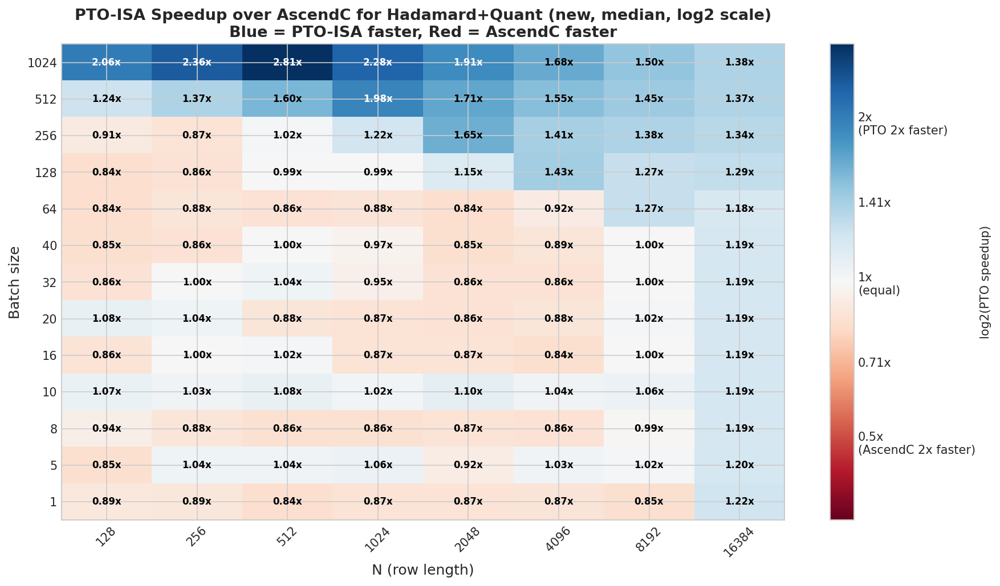
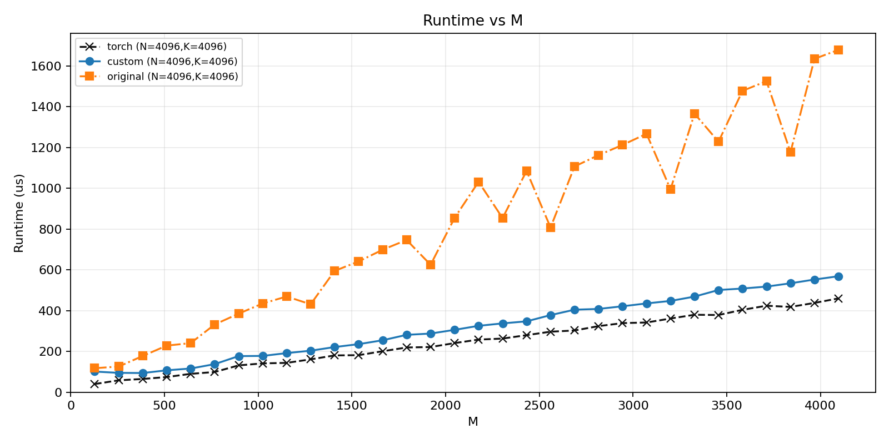

# pto-kernels-plots

Benchmark plots and performance analysis for kernel development and upstream contributions to [`pto-kernels`](https://github.com/huawei-csl/pto-kernels).

This repository contains plotting scripts, generated figures, and experiment organization used to evaluate custom Ascend NPU kernels during development and pull request review.

## Example results

### MXFP4 quantization on A5 (`mxfp4_quant_a5`, PR #223)


bf16 → MXFP4 on CANN 9.1.0-beta.3 with PTO 9.1.0. Two comparisons kept apart
because they use different call paths: ours vs PTO's `TQuant` tile op on a bare
`ctypes` launch, which isolates compute, and ours vs `torch_npu` through the
Python API, where both allocate. `mxfp4_quant_a5/plot_mxfp4_beta3.py` regenerates
every figure from the CSVs beside it.



Median PTO-ISA speedup over AscendC for Hadamard + Quant across batch size and row length.  
Blue means PTO-ISA is faster, red means AscendC is faster, and each cell shows the measured speedup ratio.

### Fused Hadamard + MXFP4 quantize on A5, two rotations


Two kernels, each fusing a Hadamard rotation with MXFP4 quantization into one
launch: `fused_hadamard_quant_a5` rotates the whole row, ten powers of two from
32 to 16384, and `fused_hadamard_quant_b32_a5` rotates independent 32-element
blocks, 26 widths from 64 to 14336. Fusing is worth 2.45x and 2.53x, and both
land near a `torch_npu` copy of the same data at 1382-1477 GB/s, so the win is
traffic and not throughput.


Rotation width does not improve quantization error. Both rotations beat no
rotation on data with outliers, 0.157 against 0.109, but the full row ties or
loses against block-32 and loses more as K grows, because spreading an outlier
across the whole row lifts every 32-block's shared scale instead of one block's.

Each directory's `plot_*.py` regenerates its figures from the CSVs beside them.

### Matmul runtime comparison



Runtime comparison across different values of `M` for `N=4096, K=4096`, showing `torch`, `custom`, and `original` implementations.  
This figure is useful for inspecting how the optimized implementation behaves relative to both a baseline implementation and a framework reference across the sweep.

## Why this repo exists

During kernel development, benchmark results and comparison plots often end up scattered across pull requests, local notebooks, and one-off scripts. This repository keeps that work in one place and documents the performance side of my upstream contributions.

In particular, it supports experiments related to:

- fused Fast Hadamard + quantization kernels
- standalone quantization kernels
- matmul kernels with L2 cache locality optimization
- other kernel comparison and regression-checking workflows

## Related upstream contributions

This repo accompanies public contribution work to [`huawei-csl/pto-kernels`](https://github.com/huawei-csl/pto-kernels), including:

- **PR #62** – fast-hadamard fused with dynamic quantization to int4
- **PR #49** – fast-hadamard fused with fp16 -> int8 dynamic quantization
- **PR #26** – PTO-ISA matmul with L2 cache locality optimization

## What is in this repository

The repository is organized by experiment family:

- `fast_hadamard/`  
  Plots and comparison artifacts for fused and unfused Fast Hadamard and quantization workflows.

- `matmul_swizzle/`  
  Performance plots for matmul kernels, including locality-aware and baseline comparisons.

- `block_rotate_fp16/`  
  Plots and related artifacts for additional kernel experiments.

## Repository structure

```text
pto-kernels-plots/
├── block_rotate_fp16/
├── fast_hadamard/
├── matmul_swizzle/
└── README.md
```
## Notes

This is a support repository for performance analysis, not a standalone kernel library.
The actual kernel implementations live in pto-kernels and related development branches.

The main purpose of this repo is to make benchmarking work visible and reproducible instead of leaving it trapped inside pull request comments and local output folders.

## Author

Hyun-Min Chang \
MSc EE/IT, ETH Zürich \
AI Research Intern at Huawei Research Center Switzerland
