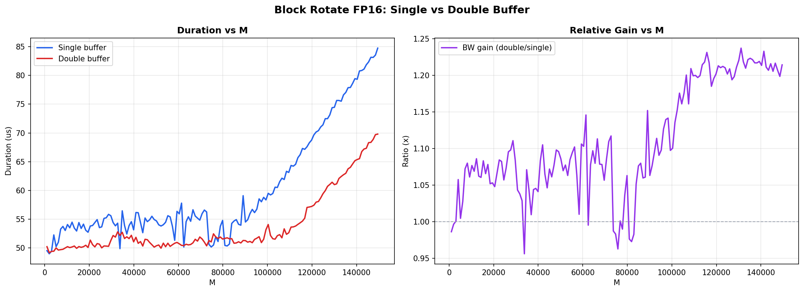
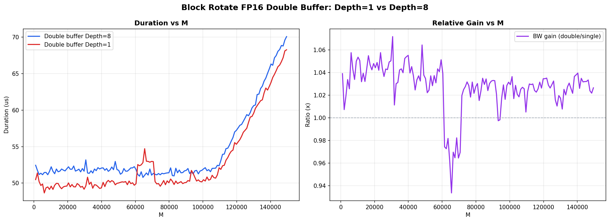

# Block Rotate FP16

Block rotation kernel operating on FP16 tensors. Block rotation is used as part of the
randomized Hadamard preprocessing step in quantization-aware inference: it applies a
structured random rotation to each block of activations before quantization, improving
quantization error by whitening the distribution.

The benchmarks here compare two design axes:
- **Single-buffer vs double-buffer** pipeline scheduling
- **Double-buffer pipeline depth** (depth=1 vs depth=8)

---

## Plots

### `single_vs_double_buffer.png`

Duration (μs) and relative bandwidth gain vs total element count M for single- and
double-buffer implementations.

**What the plots show:**

- At small M (up to ~80k), both implementations have similar duration (~50 μs). Double
  buffering already provides a small but consistent advantage here.
- Beyond M ~80k, the single-buffer curve diverges sharply, reaching ~85 μs at M=150k.
  The double-buffer implementation stays at ~70 μs, a gap of roughly 20%.
- The BW gain (double/single) grows with M, stabilizing at **1.20–1.23x** for large M.
  There are noticeable dips around M ~35k and M ~75k, suggesting alignment-sensitive
  tiling transitions where the advantage temporarily shrinks.
- **Conclusion:** double buffering is the clearly superior schedule at large tensors.
  The gain is modest at small sizes but reliable and increasingly useful as M grows.

---

### `double_buffer_depth_1_vs_8.png`

Duration and relative BW gain comparing double-buffer pipeline depth=1 against depth=8.

**What the plots show:**

- Depth=1 is consistently faster than depth=8 across the entire M range shown.
- The BW gain (depth=8 / depth=1) sits mostly between **1.02–1.07x** — i.e., depth=1
  achieves about 2–7% higher bandwidth — with generally decreasing advantage as M grows.
- There is a pronounced dip around M ~65k where depth=8 actually becomes **~6% faster**
  than depth=1 briefly (~0.94x ratio), possibly corresponding to a tiling boundary where
  the deeper prefetch happens to align better with access patterns.
- Outside of that region, deeper prefetch depth adds overhead without benefit.
- **Conclusion:** depth=1 is the recommended setting for this kernel. Increasing the
  pipeline depth to 8 does not provide a general speedup and slightly hurts performance
  on average.
