# Fast Hadamard + INT4 Dynamic Quantization (Fused)

Fused PTO-ISA kernel that performs the Fast Hadamard Transform (FHT) and dynamic INT4
quantization in a single pass. 

**UPDATE**: UB Copy vs Hadamard — compute is free at typical serving shapes

**UPDATE**: Revised Hadamard Kernel Profiling comparing the old against the new kernel

*The following are still with the Old Hadamard Kernel*\
Three unfused baselines are used for comparison, each
pairing the standalone PTO-ISA Hadamard kernel with a different NPU quantize operator:

- `Hadamard + npu_quantize` — static-scale INT4 quantize
- `Hadamard + npu_dynamic_quant` — dynamic symmetric INT4 quantize
- `Hadamard + npu_dynamic_quant_asymmetric` — dynamic asymmetric INT4 quantize
- 
---

## **UPDATE**: UB Copy vs Hadamard — Compute Hidden Behind DMA

### `copy_vs_hadamard.png`

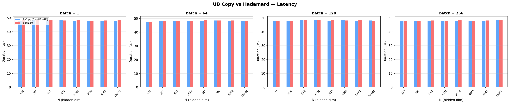

### `copy_vs_hadamard_bw.png`

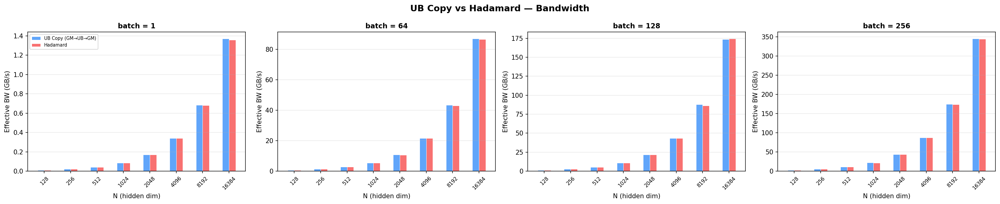

To measure how much of the Hadamard kernel's runtime is actual compute vs DMA overhead,
we built a **UB Copy** baseline kernel: it uses the exact same double-buffered
TLOAD/TSTORE pipeline (GM→UB→GM) as the Hadamard kernel but performs **zero compute** —
data is loaded into UB and immediately stored back.

**What the plots show:**

- At batch ≤ 256 and N ≤ 16384 (the typical LLM serving regime), the Hadamard kernel
  and the UB Copy kernel have **identical latency** (~48 μs). The Hadamard's radix-2
  butterfly compute is entirely hidden behind the DMA transfers.
- The bandwidth plot confirms both kernels achieve the same effective bandwidth
  (~90–350 GB/s depending on shape), meaning the kernel is purely **DMA-bound** at
  these sizes — compute is free.
- This means the Hadamard kernel is already at **theoretical maximum performance** for
  typical serving shapes: any further compute optimization (e.g. radix-4 butterfly)
  would yield zero benefit, since compute is not on the critical path.
- The compute overhead only becomes visible at larger batch sizes (≥1024) where the
  data per tile exceeds what can be overlapped with the double-buffered pipeline.

---

## **UPDATE**: Profiler traces

### `new hadamard.png` vs `old hadamard.png`

| New (9.5 μs) | Old (16.4 μs) |
|---|---|
| 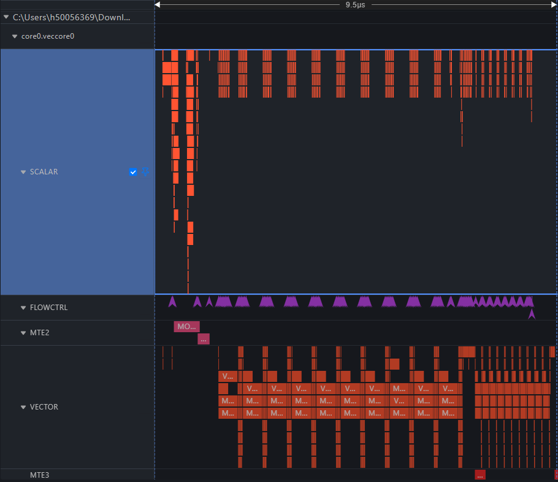 | 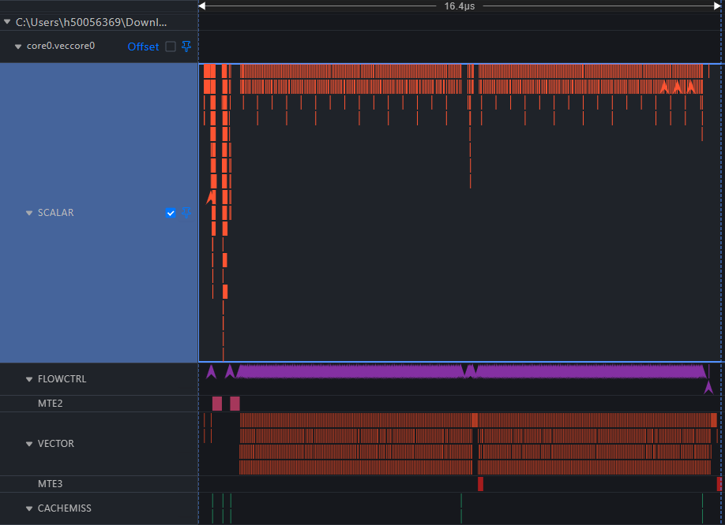 |

NPU hardware profiler traces for a single FHT kernel execution.

**What the traces show:**

- The **old kernel** (16.4 μs) has way higher `SCALAR` core activity with almost no large gaps between them, indicating high
  branching overhead throughout execution. The same activity pattern can be seen on the `VECTOR` core
- The **new kernel** (9.5 μs) sparser `SCALAR` core activity in addition to longer stretches of continuous `VECTOR` core activity.
- The new algorithm achieves a **~1.72x** reduction in execution time at this shape
  through improved pipeline overlap.

---
## Runtime Comparison

### `runtime_comparison_new_hadamard.png` vs `runtime_comparison_old_hadamard.png`
| New | Old|
|---|---|
| 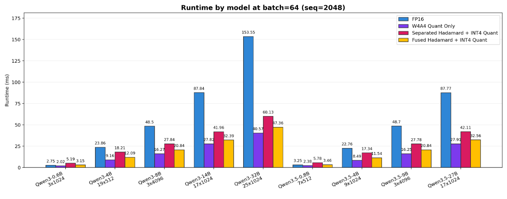 | 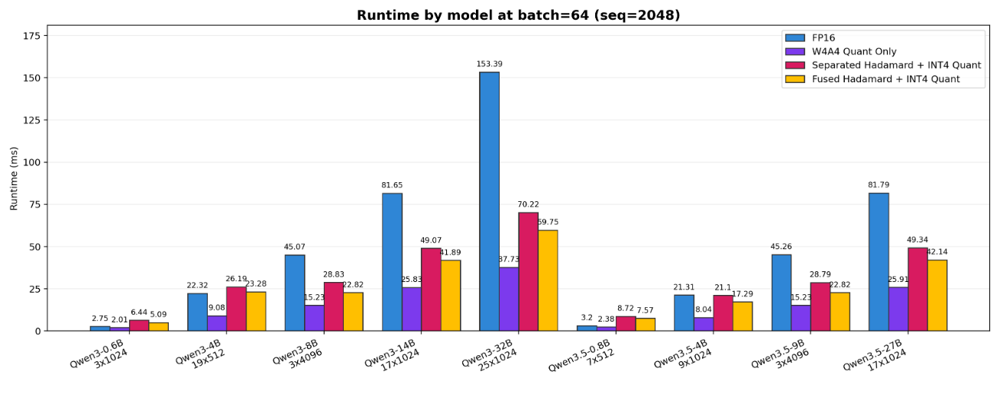 |

## Benchmark plots (Old Hadamard)

### `fused_vs_unfused_duration_bd24.png`

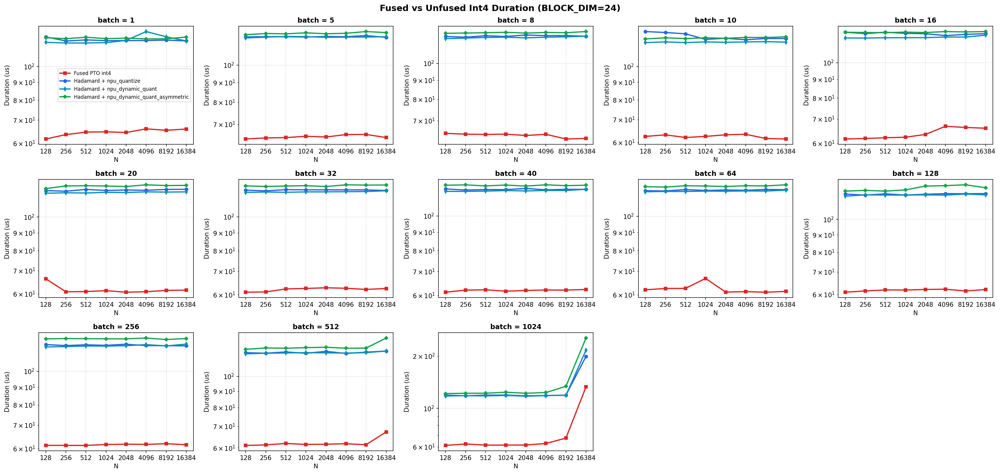

Kernel duration (μs, log scale) for the fused PTO int4 kernel (red) vs three unfused
baselines across batch × N (BLOCK_DIM=24).

**What the plot shows:**

- All three unfused baselines cluster together at a **flat ~60–100 μs** regardless of
  N, for most batch sizes. This plateau is dominated by the fixed cost of the NPU
  quantize dispatch overhead.
- The fused PTO kernel is **consistently lower**, sitting well below the unfused cluster
  for small-to-moderate batch.
- At large batch (batch=512–1024) and large N (≥8192), the unfused baselines start
  diverging upward while the fused kernel grows more gradually, making the gap
  increasingly pronounced at the largest shapes.
- At batch=1024, N=16384, the dynamic quant baselines reach ~200+ μs while the fused
  kernel is still under ~130 μs.

---

### `fused_vs_unfused_bandwidth_bd24.png`

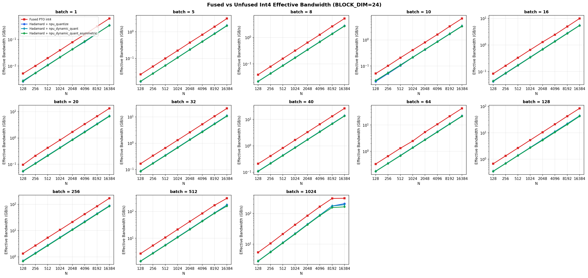

Effective bandwidth (GB/s, log scale) for fused vs unfused across batch × N.

**What the plot shows:**

- The fused PTO int4 kernel achieves uniformly higher effective bandwidth than all
  three unfused baselines across every combination of batch and N shown.
- The gap is largest at small batch, where fixed quantize overhead suppresses the
  unfused baselines to very low bandwidth. At batch=1, the fused kernel is roughly
  an order of magnitude above the asymmetric unfused baseline.
- At large batch (512–1024), `npu_quantize` and `npu_dynamic_quant` (blue and light
  green) approach the fused kernel's bandwidth range, consistent with the quantize cost
  becoming a smaller fraction of total time.
- `npu_dynamic_quant_asymmetric` (dark green) remains the lowest bandwidth baseline
  throughout, as asymmetric quantization has more compute.

---

### `fused_speedup_vs_npu_dynamic_quant_bd24.png`

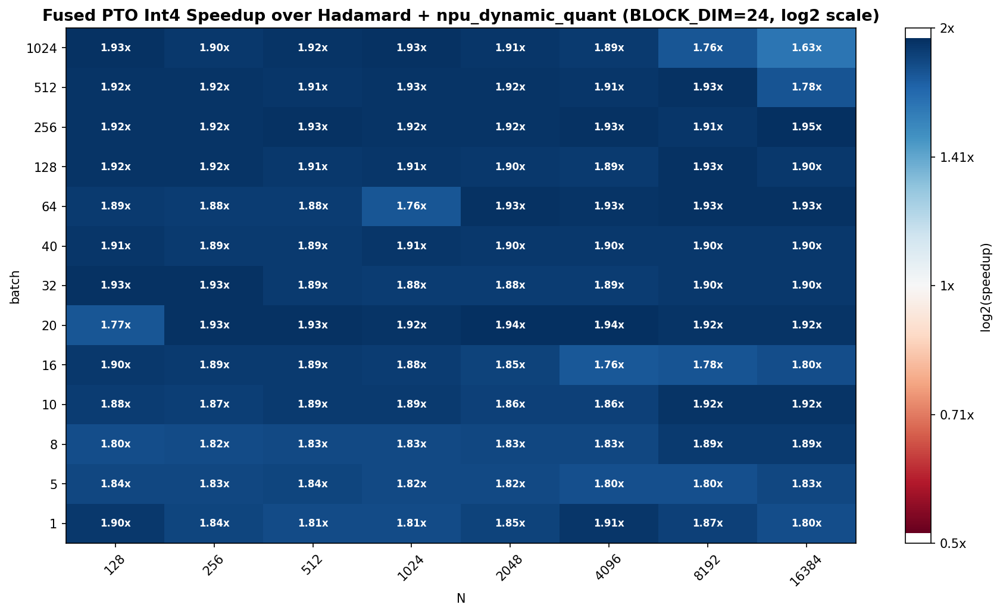

Speedup of fused PTO int4 over Hadamard + `npu_dynamic_quant` (BLOCK_DIM=24, log2 scale).

**What the plot shows:**

- Near-uniformly **~1.88–1.93x** faster across the full batch × N grid. The heatmap is
  deeply and uniformly blue, indicating a stable 2x-class speedup from fusion.
- A few isolated cells at large N / large batch dip to ~1.63–1.76x (batch=1024,
  N=16384 and N=8192) where the quantize cost becomes a smaller proportion of total time.
- The consistency of the speedup confirms it is primarily driven by one pass of HBM
  traffic being eliminated, independent of shape.

---

### `fused_speedup_vs_npu_dynamic_quant_asymmetric_bd24.png`

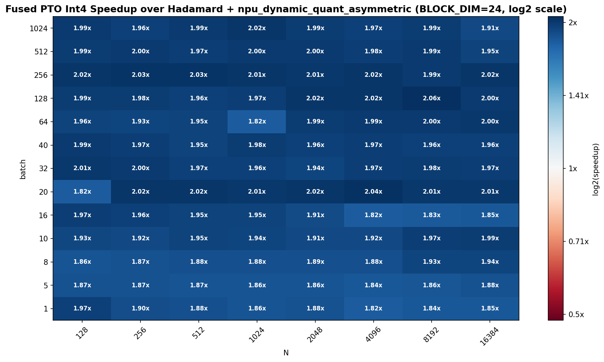

Speedup over Hadamard + `npu_dynamic_quant_asymmetric` (BLOCK_DIM=24, log2 scale).

**What the plot shows:**

- The strongest speedup across all three unfused comparators: consistently **~2.0x**
  across almost every cell including the smallest batch and N values.
- The heatmap is saturated dark blue throughout — there is no cell where the asymmetric
  unfused baseline is competitive.
- The slightly higher speedup vs this baseline compared to the symmetric version
  reflects the additional compute cost of asymmetric quantization (separate min/max
  scan), making the unfused route more expensive.

---

### `fused_speedup_vs_npu_quantize_bd24.png`

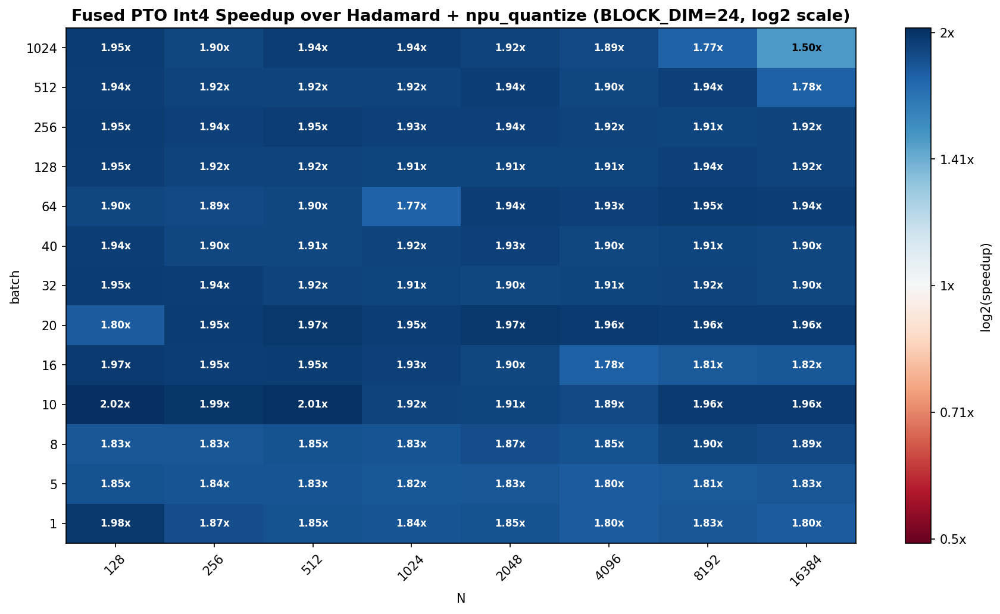

Speedup over Hadamard + `npu_quantize` (static-scale INT4, BLOCK_DIM=24, log2 scale).

**What the plot shows:**

- Speedup is **~1.80–1.95x** consistently across most shapes, slightly lower than the
  dynamic quant variants because `npu_quantize` with a precomputed scale is cheaper to
  run unfused.
- The heatmap softens to ~1.50–1.78x at large batch (≥512) and large N (≥8192), where
  the two-kernel overhead shrinks relative to total compute time.
- Still a strong and reliable advantage: even the worst case exceeds 1.5x.

---

### `hadamard_quant_speedup_vs_separate_bd24.png`

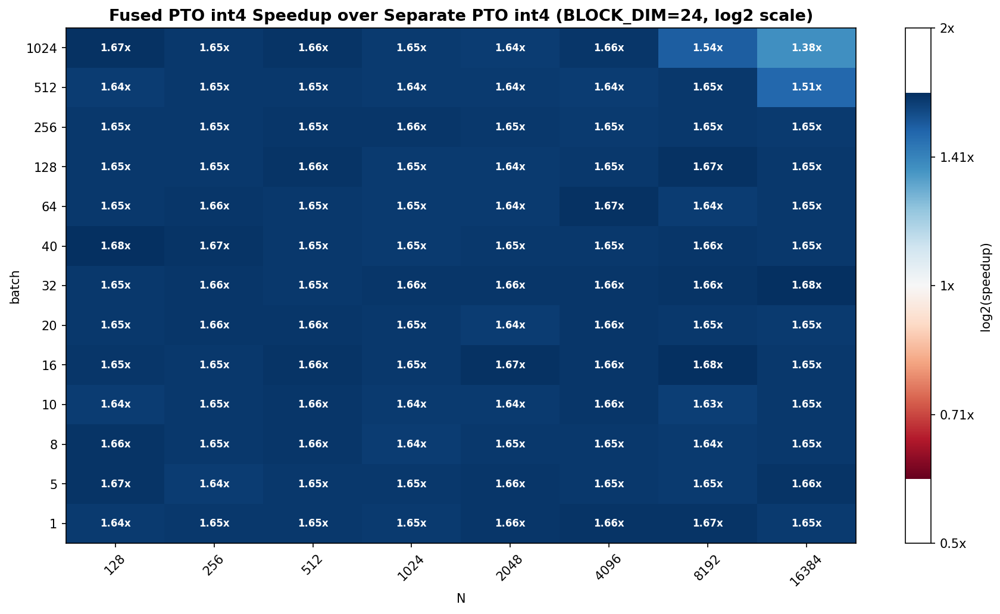

Speedup of fused PTO int4 over two-kernel PTO int4 (separate Hadamard + separate
PTO-ISA quantize), BLOCK_DIM=24.

**What the plot shows:**

- The speedup is extraordinarily uniform: almost every cell reads **~1.65x** (range
  ≈ 1.63–1.68x across the vast majority of the grid).
- This is perhaps the cleanest result in this folder: it directly measures the cost of
  the intermediate HBM round-trip with no confounding from different quantize operator
  implementations.
- The ~1.65x speedup is consistent with the fusion saving one full read + write of the
  FP16 activation tensor at these shapes.
- The only deviation is at large N (≥8192) with batch ≥512, where speedup softens to
  ~1.38–1.54x, likely because the kernel becomes compute- rather than
  bandwidth-limited at those large shapes, reducing the relative value of the
  saved memory traffic.
