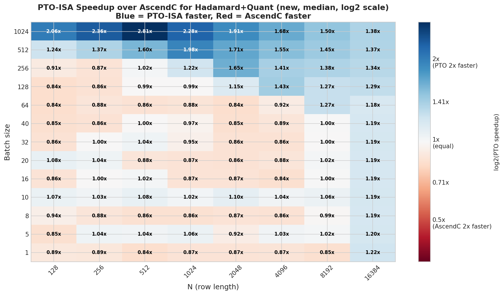
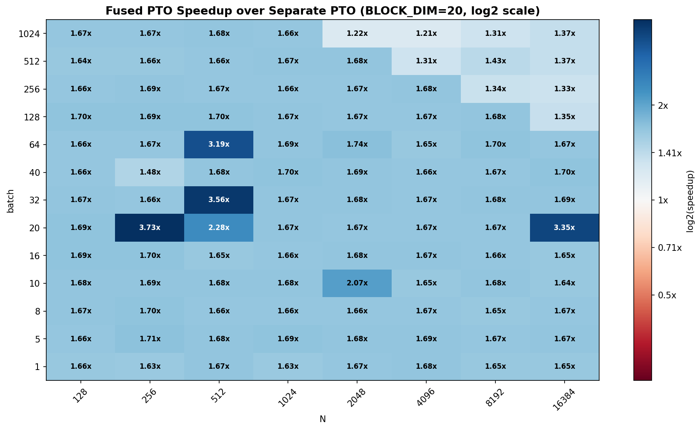
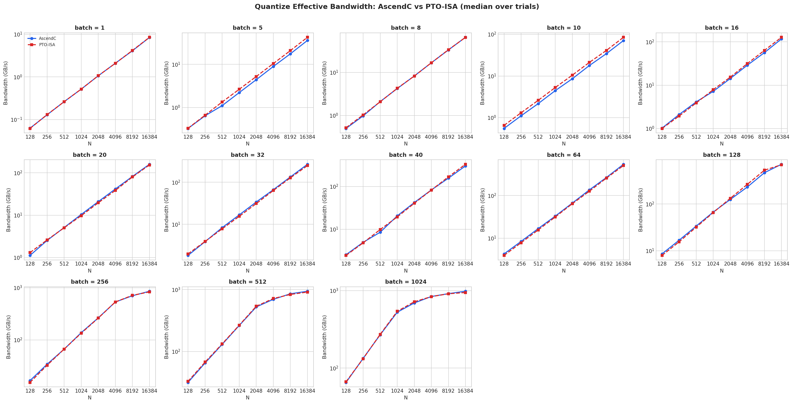
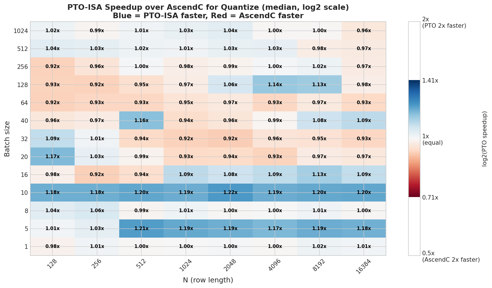

# Fast Hadamard + FP16→INT8 Dynamic Quantization

Fused PTO-ISA kernel that performs the Fast Hadamard Transform (FHT) and FP16→INT8
dynamic quantization in a single pass over the data. Fusing the two operations avoids
an intermediate write-back and re-read of the Hadamard-transformed tensor, reducing
HBM traffic by roughly one full pass.

Benchmarks compare:
- **PTO-ISA fused** kernel vs **AscendC fused** kernel (PTO-ISA vs AscendC comparison)
- **Fused PTO-ISA** vs **two separate PTO-ISA kernels** (FHT + quantize) (fusion benefit)
- **Standalone quantize** step only: PTO-ISA vs AscendC

---

## Plots

### `hadamard_quant_speedup_heatmap_new.png`

Median PTO-ISA speedup over AscendC for the fused Hadamard + INT8 quantization kernel
(log2 scale). Blue = PTO-ISA faster, red = AscendC faster.

**What the plot shows:**

- PTO-ISA has a strong advantage at **large batch (≥128) with small-to-moderate N
  (128–1024)**. Peak speedup of **1.66x** at batch=1024, N=256.
- At small batch (1–16), the picture reverses: AscendC is faster for most N values.
  The worst case is **batch=1, N=1024** at only **0.55x** — a notable regression.
- The advantage narrows at large N (8192–16384) regardless of batch size, but
  remains mildly positive for high batch.
- The breakeven point sits roughly around batch=64–128 depending on N: below that
  AscendC's lower overhead wins; above that the PTO-ISA instruction throughput advantage
  dominates.

---

### `hadamard_quant_speedup_vs_separate_bd20.png`

Speedup of the fused PTO-ISA kernel over running FHT and INT8 quantize as two
independent PTO-ISA kernels in sequence (BLOCK_DIM=20).

**What the plot shows:**

- Fusion delivers a highly consistent **~1.65–1.70x** speedup over the separate
  baseline across virtually all shapes: the speedup barely varies with batch or N.
- This near-constant ratio directly reflects the reduction in HBM traffic: a single
  pass instead of two, saving approximately one full read + write of the activation
  tensor.
- A few outlier cells reach up to **3.56x** (batch=32, N=512) and **3.73x**
  (batch=20, N=256). These extreme values are likely measurement artifacts or
  particularly favorable scheduling for the fused kernel at those shapes.

---

### `quantize_bandwidth_comparison.png`

Effective bandwidth (GB/s, log scale) for the standalone INT8 quantize step only,
comparing AscendC and PTO-ISA across the full batch × N sweep.

**What the plot shows:**

- The two curves are almost indistinguishable across all shapes: both implementations
  achieve essentially identical throughput on the quantize-only workload.
- Bandwidth scales as expected with N (log–log linear), plateauing at large batch
  (512–1024) near ~1000 GB/s, where the kernel becomes fully bandwidth-bound.
- There is no systematic advantage for either implementation on this operation in
  isolation — any difference in the fused benchmark comes purely from the Hadamard
  transform component and/or fusion overhead savings.

---

### `quantize_speedup_heatmap.png`

PTO-ISA speedup over AscendC for the standalone quantize operation (no Hadamard),
median over trials.

**What the plot shows:**

- Nearly uniform **~1.0x** across most of the grid, consistent with the identical
  bandwidth seen above.
- Two rows of modest but consistent PTO-ISA advantage stand out: **batch=5** (~1.17–
  1.21x) and **batch=10** (~1.18–1.22x across all N). These likely reflect a favorable
  alignment between the problem size and PTO-ISA's vector tile width at those specific
  batch counts.
- Occasional slight regressions (0.90–0.95x) at mid-to-high batch (64–256) and certain
  N values, suggesting AscendC is marginally better tuned there.
- The standalone quantize step does not benefit meaningfully from PTO-ISA on its own;
  the speedup from the fused kernel comes from combining it with the Hadamard pass.
