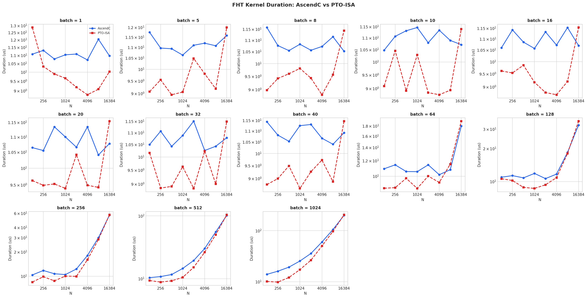
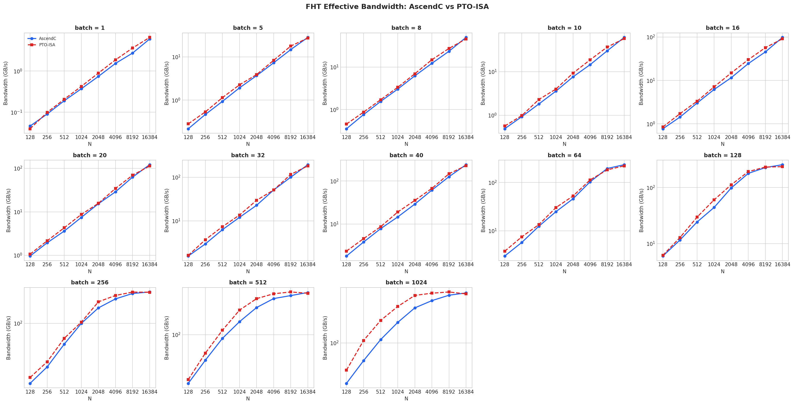
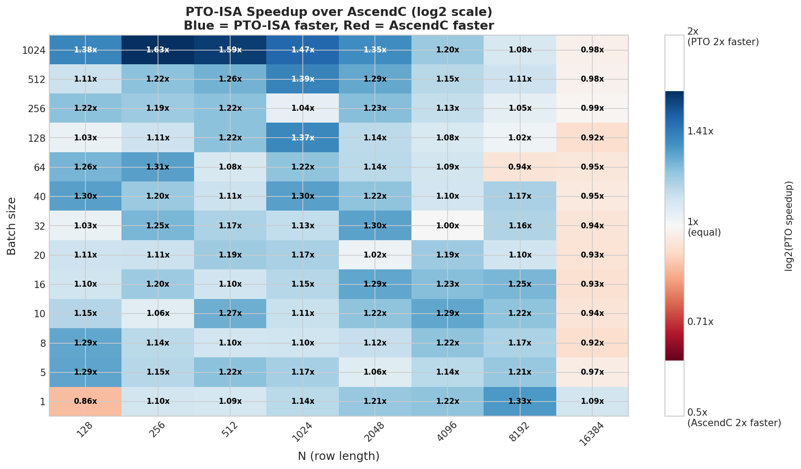
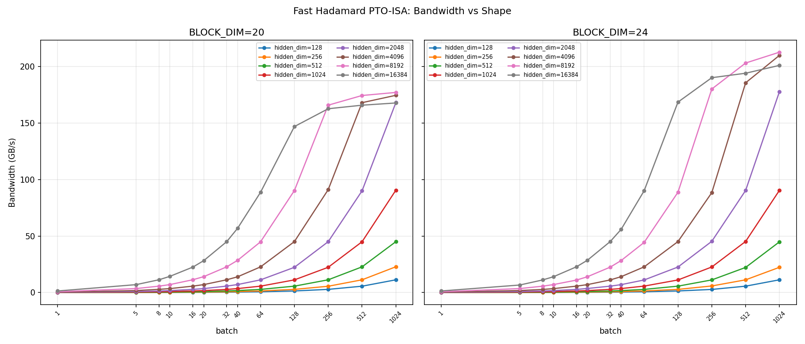

# Fast Hadamard Transform — Standard (no quantization)

Pure Fast Hadamard Transform (FHT) on FP16 inputs. This folder contains the baseline
benchmarks for the FHT kernel itself, without any fused quantization. Comparisons are
between the PTO-ISA implementation and the equivalent AscendC implementation across a
sweep of batch sizes and row lengths N.

---

## Plots

### `01_duration_comparison.png`

Kernel duration (μs, log scale) for AscendC (blue) and PTO-ISA (red) across 13 batch
sizes (1–1024) and row lengths N ∈ {128, 256, 512, 1024, 2048, 4096, 8192, 16384}.

**What the plots show:**

- For small batch sizes (1–40), PTO-ISA is consistently faster than AscendC, often by
  a large margin at specific N values. The benefit is highly shape-dependent: PTO-ISA
  shows sharp dips at certain N values (e.g. N=256 at batch=1 drops to ~9 μs) while
  AscendC stays relatively flat at ~11–13 μs.
- At moderate batch (64), the curves start to cross near N=16384, and the PTO-ISA
  advantage narrows.
- At large batch (256, 512, 1024), both implementations have very similar duration. The
  PTO-ISA still has a slight edge for small N, but the curves largely overlap at large N.
- The overall minimum latency of the PTO-ISA kernel at small batch is noticeably lower
  than AscendC, reflecting the lower instruction overhead of the PTO-ISA path.

---

### `02_bandwidth_comparison.png`

Effective bandwidth (GB/s, log scale) for both implementations across the same
batch × N sweep.

**What the plots show:**

- Both implementations track each other closely on a log scale across all shapes.
- PTO-ISA is marginally above AscendC in bandwidth across most cells, particularly at
  mid-to-large batch sizes.
- At large batch (256–1024) and large N, both implementations plateau around **300–400
  GB/s**, consistent with being memory-bandwidth bound.
- At very small batch and small N, bandwidth is below 1 GB/s, reflecting that fixed
  kernel launch and setup costs dominate the measured time at these tiny problem sizes.

---

### `03_speedup_heatmap.png`

PTO-ISA speedup (ratio) over AscendC on a log2 color scale. Blue = PTO-ISA faster,
red = AscendC faster.

**What the plots show:**

- The heatmap is predominantly blue: PTO-ISA is faster in the large majority of shapes.
- The strongest speedups (up to **1.63x** at batch=1024, N=256) appear at large batch
  with small-to-mid N.
- At N=16384, the advantage consistently shrinks toward ~1.0x or slightly below for all
  batch sizes, suggesting that at very long rows the two implementations become equally
  bandwidth-limited.
- The only notable AscendC advantage is at **batch=1, N=128** (0.86x), where the
  PTO-ISA kernel is slower likely due to dispatch or scheduling overhead at the smallest
  possible workload.
- Speedup values are not monotone in N or batch; a checkerboard-like pattern is visible,
  consistent with BLOCK_DIM alignment effects causing periodic tiling transitions.

---

### `bw_vs_shape.png`

Effective bandwidth (GB/s) vs batch for each hidden dimension, comparing BLOCK_DIM=20
and BLOCK_DIM=24.

**What the plots show:**

- Bandwidth grows roughly linearly with batch at small batch, then saturates once the
  kernel is fully occupying the available memory bandwidth.
- The saturation point shifts to larger batch for smaller hidden dimensions: e.g.
  hidden_dim=16384 saturates around batch=128–256, while hidden_dim=1024 is still
  growing at batch=1024.
- Very small hidden dimensions (128, 256) never reach high bandwidth regardless of batch
  size, staying below ~10 GB/s and ~25 GB/s respectively.
- **BLOCK_DIM=24** achieves a slightly higher peak bandwidth (**~215 GB/s**) compared to
  BLOCK_DIM=20 (**~175 GB/s**) for the largest hidden dims at saturation.
- The shape of the saturation curve is consistent across both BLOCK_DIM settings; the
  main effect is a uniform upward shift in peak bandwidth for BLOCK_DIM=24.
