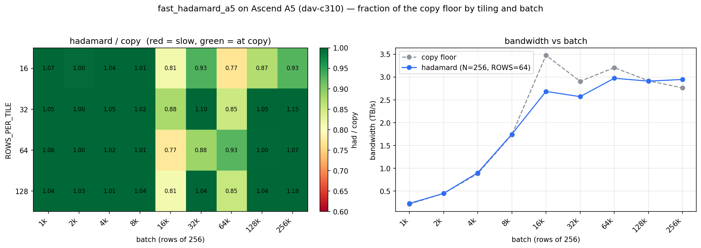
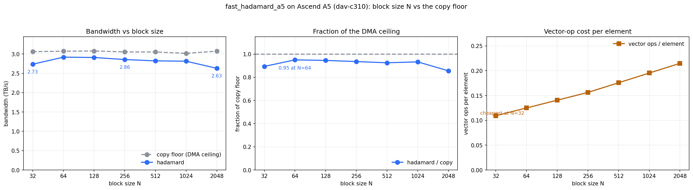

# Fast Walsh–Hadamard on Ascend A5: matching HBM copy speed <br/> (and when the matrix unit beats the vector pipe)

- Author: Hyun-Min Chang

**TL;DR**: The Walsh–Hadamard transform (WHT) is a **memory-bound** streaming op, so the right target is not peak FLOPs but *how close to a plain memory copy can we get*. On Ascend 950 / A5 (`dav-c310`) we built and benchmarked several fp16 WHT kernels in PTO-ISA. The **N=256 deinterleave-load** kernel reaches **~2.8 TB/s — essentially the HBM copy floor** (91–100% of copy across large batches). For **N=128**, offloading the transform to the **cube (matrix) unit** as a matmul (**2.03 TB/s**) beats both a deinterleave-load kernel (1.90) and a register-resident vector butterfly (1.51). Every kernel is verified correct (max rel error ~1e-3 vs a PyTorch reference).

**To reproduce everything in this post**, see:
- Kernels, benchmarks, correctness tests: [`pto-kernels/examples/jit_cpp/fast_hadamard_a5`](https://github.com/huawei-csl/pto-kernels/tree/master/examples/jit_cpp/fast_hadamard_a5)
- Plots and raw CSV data: this directory. The plotting scripts live here rather than
  in the upstream PR, which ships only the kernel, its benchmark and its tests. The
  CSV emitted by `benchmark.py` is the contract between the two:

  ```bash
  # in pto-kernels/examples/jit_cpp/fast_hadamard_a5 (needs an A5 device)
  python benchmark.py 64            # -> build/grid.csv
  python benchmark.py 64 --nsweep   # -> build/nsweep.csv

  # here (needs only matplotlib)
  python plot_hadamard_grid_a5.py     --csv <path>/build/grid.csv
  python plot_hadamard_nsweep_a5.py --csv <path>/build/nsweep.csv
  ```

# Outline

- [Background: the WHT is memory-bound](#background-the-wht-is-memory-bound)
- [Three ways to compute N=128](#three-ways-to-compute-n128)
  - [1. Register-resident vector butterfly (the baseline)](#1-register-resident-vector-butterfly-the-baseline)
  - [2. Cube / matmul against the Hadamard matrix](#2-cube--matmul-against-the-hadamard-matrix)
  - [3. Deinterleave-load: fold the butterfly into the DMA](#3-deinterleave-load-fold-the-butterfly-into-the-dma)
- [N=256: the deinterleave-load kernel reaches copy speed](#n256-the-deinterleave-load-kernel-reaches-copy-speed)
- [Measuring against the copy floor](#measuring-against-the-copy-floor)
- [Pipeline depth and the UB budget](#pipeline-depth-and-the-ub-budget)
- [Block size: how wide can one row be?](#block-size-how-wide-can-one-row-be)
- [Correctness](#correctness)

# Background: the WHT is memory-bound

The (normalized) Walsh–Hadamard transform of a length-`N` row `x` is `y = x · H / √N`, where `H` is the ±1 Hadamard matrix. It is the rotation step in incoherence/random-projection preprocessing for low-bit quantization, and appears in several linear-attention variants. For a batch of rows it is pure streaming: read each row once, run a `log2(N)`-stage butterfly of adds/subtracts, write it back. `H` is a tiny constant (128×128 or 256×256) with no reuse across rows.

So the ceiling is **HBM bandwidth, not compute**. The honest yardstick is a plain `GM → UB → GM` **copy** with the *same* tiling: if the transform runs at the copy's bandwidth, it is optimal — there is nothing left to win. Every result below is reported as `hadamard / copy`, and "green = at the copy floor."

All numbers are from a single Ascend 950 / A5 device, fp16, in-place, `block_dim = 64` (= the device's ~64 AI cores).

# Three ways to compute N=128

The interesting design question is *where* to spend the butterfly. We implemented three answers and benchmarked them head-to-head at batch 65536:

| Kernel | Where the work lands | TB/s | % of copy floor |
|--------|----------------------|-----:|----------------:|
| `fast_hadamard_128_cube_a5` | cube / matrix unit | **2.03** | **76%** |
| `fast_hadamard_128_dintlv_a5` | DMA load/store units | 1.90 | 70% |
| `fast_hadamard_128_a5` | vector-execute (VF) pipe | 1.51 | 57% |

(Copy floor at N=128 is ~2.7 TB/s.)

## 1. Register-resident vector butterfly (the baseline)

The straightforward kernel keeps a 128-lane row in a vector register and runs all 7 butterfly stages register-resident: `vdintlv` (even/odd split) → `vadd`/`vsub` → `vsel` (concat-halves recombine), 8-way unrolled to hide the dependency chain, then one `vmuls` for the `1/√128` scale. No UB round-trips between stages.

It is correct and clean, but **compute-bound**: ~28 vector ops per row all sit on the VF pipe, which becomes the bottleneck at ~1.5 TB/s — only 57% of copy. The DMA is idle waiting on the vector pipe.

## 2. Cube / matmul against the Hadamard matrix

`y = x · H` is literally a matmul, and the A5 has a dedicated **cube (matrix) unit** that is nearly idle in the kernel above. So we pre-scale `H` (the Hadamard matrix, times `1/√128`) once, keep it resident in `L0B`, and per 128-row tile do a single `TMATMUL` (`X @ H`) with the result accumulated in fp32 and streamed back out. Because `H` is symmetric, no transpose bookkeeping is needed.

The matmul FLOPs are trivial relative to the memory traffic, so the kernel is now **memory-bound**: **2.03 TB/s, 76% of copy** — the best N=128 result, and *more* accurate than the vector path (the accumulation is fp32). The lesson: on an NPU with both a vector and a matrix engine, a "vector" op that is secretly a small matmul is often fastest on the matrix engine, precisely because that frees the vector pipe from being the bottleneck.

## 3. Deinterleave-load: fold the butterfly into the DMA

There is a third place to put the work: the **load/store units themselves**. Each butterfly stage needs an even/odd deinterleave and a concat-halves recombine — and on `dav-c310` the vector load/store can do that addressing *for free*. So every stage becomes: `vlds ... DINTLV_B16` (the load splits even lanes → one register, odd → another), `vadd`/`vsub` for the sums/diffs, and `vsts` that writes sums to the low half and diffs to the high half. Only the add/sub touches the VF pipe.

At N=256 this is a full-width (128-lane) operation and it flies (next section). At N=128 a row is a single register, so the even/odd split is 64+64 and the ops run **half-width** (`LANES = N/2 = 64`). That halved SIMD utilization is why the N=128 deinterleave kernel lands at **1.90 TB/s (70%)** — better than the register butterfly, but still short of the cube. *For N=128, use the cube kernel.*

# N=256: the deinterleave-load kernel reaches copy speed

At N=256 the deinterleave-load technique is in its element: a row spans two 128-lane registers, so the even/odd split is full-width and the vector pipe does nothing but `vadd`/`vsub` while the DMA streams. The result tracks the copy floor across essentially the entire batch × tiling grid:



**What the plot shows** (heatmap: `had/copy`, red = slow, green = at copy; line: absolute TB/s vs batch):

- The kernel is **at the copy floor across the whole grid** — `ROWS_PER_TILE ∈ {16, 32, 64, 128}` are all green once past the small-batch, launch-overhead region on the left.
- Absolute bandwidth climbs out of the fixed launch-overhead floor and **saturates near ~2.8–3.0 TB/s**, tracking the copy line the whole way.
- The only softening is the batch = 64k column (`had/copy ≈ 0.78–0.92`) — and that is where the *copy floor itself* peaks (~3.0 TB/s); the transform recovers by 128k–256k.
- `ROWS_PER_TILE` barely matters in the memory-bound regime; the default `64` is fine.

For a purely memory-bound op, "green everywhere" is the whole game — there is no faster it can go than a copy, and it is a copy.

# Measuring against the copy floor

Because the transform is memory-bound, we benchmark every kernel against a pure `GM → UB → GM` **copy** that uses the exact same tiling — the copy is the DMA ceiling for that shape, so it is the right thing to be judged against. The reported metric is `hadamard / copy` (median over several trials, `block_dim = 64`); a ratio near `1.0` means the transform is running at memory-copy speed. That is the yardstick behind every number in this post.

# Pipeline depth and the UB budget

These kernels were first written against the Ascend A2 (910B), whose Unified Buffer is **192 KB**. The A5's is **248 KB**, so the obvious question is whether the extra 56 KB buys anything — and for a while our answer was wrong in an instructive way.

A larger budget lets the pipeline run deeper: `NBUF=6` instead of 4. The first time we tried it, the kernel died with device fault `507035`. We wrote that down as "the A5's extra UB isn't usable here" and moved on, since the transform was already at copy speed.

It was never a UB problem. The kernel computed its per-buffer UB offsets by indexing a **fixed four-element table** with `K % NBUF`. At `NBUF=6` that reads two entries past the end of the array, so the DMA landed at a garbage offset — an out-of-bounds read wearing a hardware fault's clothing. The event-ID array beside it was correctly sized for eight, which is exactly why "we must have run out of event IDs" felt plausible and was still wrong.

Computing those offsets arithmetically instead of reading them from a table fixes it, and then the real answer shows up:

| pipeline depth | UB budget | batch 65536 | batch 262144 |
|---|---|---|---|
| `NBUF=4` | 192 KB | 2668 GB/s | 2795 GB/s |
| `NBUF=6` | 192 KB | 2634 GB/s | 2769 GB/s |
| `NBUF=6` | 248 KB | 2622 GB/s | 2775 GB/s |

Deeper is marginally **slower**, and the larger budget changes nothing measurable. That is what a memory-bound kernel should do: four buffers already keep the load and store pipes saturated, and beyond that point spare UB is just spare UB. The original conclusion — not worth pursuing — held up. The reason we had given for it did not.

# Block size: how wide can one row be?

`N` is a compile-time constant, and one fp16 vector register holds 128 elements. A stage
splits its work into two half-rows of `N/2`, so at **N=256** each half is exactly one full
vector — and for a while that made N=256 look like a sweet spot with the curve falling away
on both sides. It wasn't a sweet spot; it was the only size that happened to fit.

Two changes make the vector full at every `N`. Above 256, a row is split into
`CHUNKS = (N/2)/128` independent pieces. Below 256, `R = 256/N` **rows are packed into one
window**, so a stage at N=32 drives all 128 lanes instead of 16. Packing works because a
stage only pairs adjacent elements within a row: the split is on the low bit of the
within-row index and `N` is even, so row `r`'s evens always land contiguously in group `r`
and rows never mix.

Packing does permute the result — a packed window emerges with its index **rotated right by
log2(N)**. That sounds expensive and isn't: `vdintlv` rotates a whole 256-element
(two-register) window right by one in a single register-to-register op, so `8 − log2(N)` of
them finish the job, fused into the last stage using registers that are already dead. One op
at N=128, three at N=32, against the 25–35 ops of butterfly they make possible.



| N | 32 | 64 | 128 | 256 | 512 | 1024 | 2048 |
|---|---|---|---|---|---|---|---|
| rows packed | 8 | 4 | 2 | 1 | 1 | 1 | 1 |
| GB/s | 2712 | 2700 | 2691 | 2664 | 2624 | 2590 | 2554 |
| fraction of copy floor | **0.96** | 0.94 | 0.94 | 0.94 | 0.92 | 0.91 | 0.90 |
| before packing | 0.30 | 0.47 | 0.76 | 0.93 | 0.92 | 0.92 | 0.90 |

The middle panel is now flat: **the transform is memory-bound at every size**, which is the
result you want from a kernel whose arithmetic is a handful of adds. N=32 went from 0.30 to
0.96 of its own DMA ceiling — measured in-process against the old kernel, +223%. N=128, the
size that matters most in practice, gained +27% and comfortably clears the 2.03 TB/s cube
kernel it used to lose to. The third panel is the reason the old curve sagged at small `N`
and the new one doesn't: cost per element is now `(5·log2(N) + log2(R)) / 256`, which no
longer blows up as `N` shrinks.

The correctness evidence is worth stating precisely, because it is stronger than a
tolerance. The packed kernel adds the *same operand-ordered pairs in the same stage order*
as the per-row one, so its output should be **bit-identical**, not merely close — and it is,
at every `N` from 32 to 2048. A relative-error check would have accepted a subtly wrong
permutation; `torch.equal` does not.

Two traps are recorded here because both produced *correct-looking* wrong answers rather
than crashes. The first: handling a wide row with a per-chunk load/store loop aliases in
place, because a stage's sums compact into the lower half of the row, which is exactly where
a lower-numbered chunk still needs to read from. It passed at N=512 — the loads were reading
input the stores had not yet committed — and corrupted at N=1024. Forcing the stores to land
turned the N=512 error from `8e-4` into `5.1`, which is how it was confirmed. The second is
the same shape one level up: doing the rotation through UB instead of in registers would
re-read a just-written window and need an explicit barrier. Both are avoided structurally
rather than by getting the timing lucky.

Packing also creates one genuinely new hazard: at N=32 a window holds eight rows, and batch
padding can occupy seven of them. "Rows never mix" says padding cannot contaminate real
rows, so that gets asserted adversarially — fill the padding with `inf` and `nan` and require
the real rows to come out bit-identical to an unpadded run.

# Correctness

Every configuration is checked against a PyTorch reference implementation:

- N=256, all `ROWS_PER_TILE`: identical max rel error **`8.5e-4`** (the tiling does not perturb the math), and the copy reference preserves data bit-exactly.
- N=128 cube: rel **`2.7e-4`** (fp32 accumulation is the most accurate of the three).
- N=128 deinterleave / register-VF: rel **`8e-4` / `9e-4`**.

No accuracy surprises — just kernels that run at the speed of memory.
