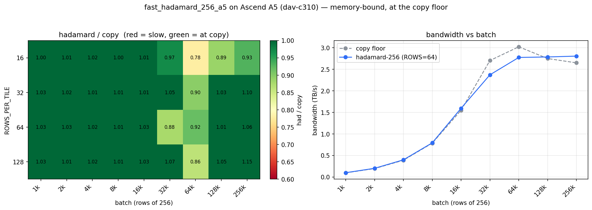

# Fast Walsh–Hadamard on Ascend A5: matching HBM copy speed   (and when the matrix unit beats the vector pipe)

- Author: Hyun-Min Chang

**TL;DR**: The Walsh–Hadamard transform (WHT) is a **memory-bound** streaming op, so the right target is not peak FLOPs but *how close to a plain memory copy can we get*. On Ascend 950 / A5 (`dav-c310`) we built and benchmarked several fp16 WHT kernels in PTO-ISA. The **N=256 deinterleave-load** kernel reaches **~2.8 TB/s — essentially the HBM copy floor** (91–100% of copy across large batches). For **N=128**, offloading the transform to the **cube (matrix) unit** as a matmul (**2.03 TB/s**) beats both a deinterleave-load kernel (1.90) and a register-resident vector butterfly (1.51). Every kernel is verified correct (max rel error ~1e-3 vs the Sylvester reference).

**To reproduce everything in this post**, see:
- Kernels, benchmarks, correctness tests: [`pto-kernels/examples/jit_cpp/fast_hadamard_a5`](https://github.com/huawei-csl/pto-kernels/tree/master/examples/jit_cpp/fast_hadamard_a5)
- Plots and raw CSV data: this directory (`bench256_grid.py` → `plot_hadamard256_grid.py`)

# Outline

- [Background: the WHT is memory-bound](#background-the-wht-is-memory-bound)
- [Three ways to compute N=128](#three-ways-to-compute-n128)
  - [1. Register-resident vector butterfly (the baseline)](#1-register-resident-vector-butterfly-the-baseline)
  - [2. Cube / matmul against the Hadamard matrix](#2-cube--matmul-against-the-hadamard-matrix)
  - [3. Deinterleave-load: fold the butterfly into the DMA](#3-deinterleave-load-fold-the-butterfly-into-the-dma)
- [N=256: the deinterleave-load kernel reaches copy speed](#n256-the-deinterleave-load-kernel-reaches-copy-speed)
- [Measuring against the copy floor (and a benchmark that lied)](#measuring-against-the-copy-floor-and-a-benchmark-that-lied)
- [How much UB can we actually use? 192 vs 248 KB](#how-much-ub-can-we-actually-use-192-vs-248-kb)
- [Correctness](#correctness)

# Background: the WHT is memory-bound

The (normalized) Walsh–Hadamard transform of a length-`N` row `x` is `y = x · H / √N`, where `H` is the ±1 Sylvester–Hadamard matrix. It is the rotation step in incoherence/random-projection preprocessing for low-bit quantization, and appears in several linear-attention variants. For a batch of rows it is pure streaming: read each row once, run a `log2(N)`-stage butterfly of adds/subtracts, write it back. `H` is a tiny constant (128×128 or 256×256) with no reuse across rows.

So the ceiling is **HBM bandwidth, not compute**. The honest yardstick is a plain `GM → UB → GM` **copy** with the *same* tiling: if the transform runs at the copy's bandwidth, it is optimal — there is nothing left to win. Every result below is reported as `hadamard / copy`, and "green = at the copy floor."

All numbers are from a single Ascend 950 / A5 device, fp16, in-place, `block_dim = 64` (= the device's ~64 AI cores).

# Three ways to compute N=128

The interesting design question is *where* to spend the butterfly. We implemented three answers and benchmarked them head-to-head at batch 65536:

| Kernel | Where the work lands | TB/s | % of copy floor |
|--------|----------------------|-----:|----------------:|
| `fast_hadamard_128_cube_a5` | cube / matrix unit | **2.03** | **76%** |
| `fast_hadamard_128_dintlv_a5` | DMA load/store units | 1.90 | 70% |
| `fast_hadamard_128_a5` | vector-execute (VF) pipe | 1.51 | 57% |

(Copy floor at N=128 is ~2.7 TB/s.)

## 1. Register-resident vector butterfly (the baseline)

The straightforward kernel keeps a 128-lane row in a vector register and runs all 7 butterfly stages register-resident: `vdintlv` (even/odd split) → `vadd`/`vsub` → `vsel` (concat-halves recombine), 8-way unrolled to hide the dependency chain, then one `vmuls` for the `1/√128` scale. No UB round-trips between stages.

It is correct and clean, but **compute-bound**: ~28 vector ops per row all sit on the VF pipe, which becomes the bottleneck at ~1.5 TB/s — only 57% of copy. The DMA is idle waiting on the vector pipe.

## 2. Cube / matmul against the Hadamard matrix

`y = x · H` is literally a matmul, and the A5 has a dedicated **cube (matrix) unit** that is nearly idle in the kernel above. So we pre-scale `H = Sylvester(128)/√128` once, keep it resident in `L0B`, and per 128-row tile do a single `TMATMUL` (`X @ H`) with the result accumulated in fp32 and streamed back out. Because `H` is symmetric, no transpose bookkeeping is needed.

The matmul FLOPs are trivial relative to the memory traffic, so the kernel is now **memory-bound**: **2.03 TB/s, 76% of copy** — the best N=128 result, and *more* accurate than the vector path (the accumulation is fp32). The lesson: on an NPU with both a vector and a matrix engine, a "vector" op that is secretly a small matmul is often fastest on the matrix engine, precisely because that frees the vector pipe from being the bottleneck.

> A subtlety worth flagging for anyone writing cube kernels: the `<<<>>>` launch and the kernel *definition* must be visible on **both** the host and device compiler passes; only the device-only kernel **body** is guarded by `__DAV_CUBE__`. Guarding the launch itself compiles it out on the host pass and the kernel silently becomes a no-op — it runs, returns success, and leaves the input untouched.

## 3. Deinterleave-load: fold the butterfly into the DMA

There is a third place to put the work: the **load/store units themselves**. Each butterfly stage needs an even/odd deinterleave and a concat-halves recombine — and on `dav-c310` the vector load/store can do that addressing *for free*. So every stage becomes: `vlds ... DINTLV_B16` (the load splits even lanes → one register, odd → another), `vadd`/`vsub` for the sums/diffs, and `vsts` that writes sums to the low half and diffs to the high half. Only the add/sub touches the VF pipe.

At N=256 this is a full-width (128-lane) operation and it flies (next section). At N=128 a row is a single register, so the even/odd split is 64+64 and the ops run **half-width** (`LANES = N/2 = 64`). That halved SIMD utilization is why the N=128 deinterleave kernel lands at **1.90 TB/s (70%)** — better than the register butterfly, but still short of the cube. *For N=128, use the cube kernel.*

# N=256: the deinterleave-load kernel reaches copy speed

At N=256 the deinterleave-load technique is in its element: a row spans two 128-lane registers, so the even/odd split is full-width and the vector pipe does nothing but `vadd`/`vsub` while the DMA streams. The result tracks the copy floor across essentially the entire batch × tiling grid:

**What the plot shows** (heatmap: `had/copy`, red = slow, green = at copy; line: absolute TB/s vs batch):

- The kernel is **at the copy floor across the whole grid** — `ROWS_PER_TILE ∈ {16, 32, 64, 128}` are all green once past the small-batch, launch-overhead region on the left.
- Absolute bandwidth climbs out of the fixed launch-overhead floor and **saturates near ~2.8–3.0 TB/s**, tracking the copy line the whole way.
- The only softening is the batch = 64k column (`had/copy ≈ 0.78–0.92`) — and that is where the *copy floor itself* peaks (~3.0 TB/s); the transform recovers by 128k–256k.
- `ROWS_PER_TILE` barely matters in the memory-bound regime; the default `64` is fine.

For a purely memory-bound op, "green everywhere" is the whole game — there is no faster it can go than a copy, and it is a copy.

# Measuring against the copy floor (and a benchmark that lied)

A cautionary tale, because it nearly fooled us. Our first grid recompiled the copy reference at every `ROWS_PER_TILE` and timed each cell with a single loop. It produced copy bandwidths **above 5 TB/s** — physically impossible on this device (real HBM peak is ~3.2 TB/s). The transform looked like it was running at 0.4× a copy that was itself faster than the memory bus.

Two bugs, both on the measurement side (the kernels were fine — the copy provably preserved data bit-for-bit):

1. **The copy reference overran UB at large tiles.** `copy256` hard-codes a 2-buffer ping-pong; at `ROWS_PER_TILE=256` that is `2 × 128 KB = 256 KB`, over the UB budget, so its timing was meaningless.
2. **Event-timer glitches** under a single tight loop occasionally read ~2× too fast.

The fix: measure the copy floor from **one fixed, UB-valid `ROWS_PER_TILE=64` build**, take the **median of 7 trials** per batch, and use a working set larger than L2 so the copy hits HBM rather than cache. After that, the copy floor peaks at a believable **3.03 TB/s** and every ratio lands in `[0.78, 1.15]`. The moral: when a benchmark reports something faster than a memory copy, believe the memory bus, not the benchmark.

# How much UB can we actually use? 192 vs 248 KB

The kernels hard-code a `192 KB` UB budget, but the A5's Unified Buffer is actually **248 KB** — so were we leaving ~56 KB (and performance) on the table? We made the bound overridable (`UB_USABLE_BYTES`) and swept pipeline depth (`NBUF`) against the real budget.

The answer is a clean "no, and here's why":

- A deeper pipeline helps only up to `NBUF=4` (batch 64k: `NBUF=2` → 2.2 TB/s, `NBUF=4` → 2.7 TB/s), and `NBUF=4` **already fits inside 192 KB** for these tiles.
- `NBUF ≥ 6` **reproducibly device-faults** (runtime error `507035`). The kernel reuses a single event ID per buffer for all three pipe handoffs (buffer-free → load-done → compute-done), which only holds up to ~4 outstanding loads.

So the binding constraint is the **event-flag protocol, not UB capacity** — the extra 56 KB is unusable without redesigning the sync (distinct event IDs per handoff, or the unit-flag mechanism), and there is little upside since the kernel is already copy-bound at large batch. `192 KB` turned out to be a real ceiling of the kernel's design, not of the hardware.

# Correctness

Every configuration is checked against `x · Sylvester(N)` computed in fp64:

- N=256, all `ROWS_PER_TILE`: identical max rel error **`8.5e-4`** (the tiling does not perturb the math), and the copy reference preserves data bit-exactly.
- N=128 cube: rel **`2.7e-4`** (fp32 accumulation is the most accurate of the three).
- N=128 deinterleave / register-VF: rel **`8e-4` / `9e-4`**.

No accuracy surprises — just kernels that run at the speed of memory.
