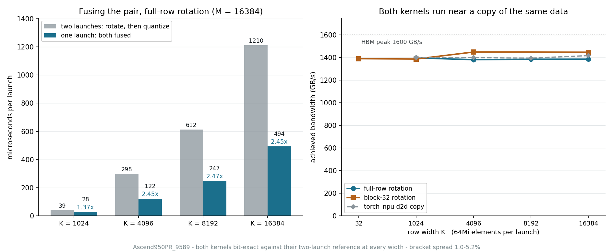
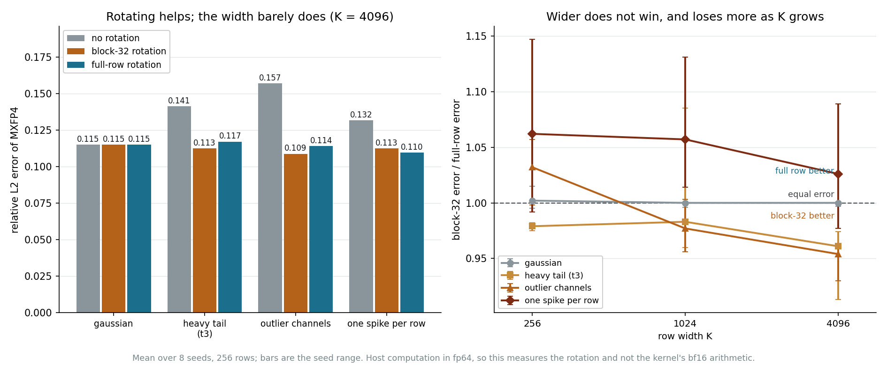
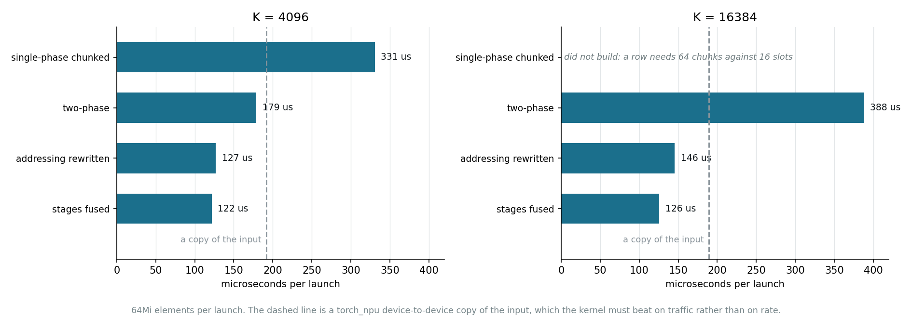

# fused_hadamard_quant_a5 — the full-row rotation, and what its width costs

Measurements for `pto-kernels` at
`examples/jit_cpp/fused_hadamard_quant_a5`, plus the two comparisons that span
both kernels. The block-32 kernel's own sweeps live in
`../fused_hadamard_quant_b32_a5`.

## What fusing buys, and how close to a copy it gets



Left, the same rotation and quantizer as two launches and then as one. Right,
both kernels against a `torch_npu` device-to-device copy of the input, which is
a reference for what moving the bytes costs.

The right panel is the one that says the result is traffic rather than
throughput. All the curves sit together near 1400 GB/s, so neither kernel is
moving bytes faster than a copy; both are moving fewer of them, 2.53 B/element
against 4.00. The full-row kernel is also flat in width: 121.5 to 122.9
microseconds across a 16x range of K, because the transform is entirely hidden
under the DMA at every width.

The copy is a reference, not a proven lower bound. It is a vendor kernel doing a
simpler job, and nothing here shows it is optimal, so a kernel matching it has
matched that reference rather than reached the hardware limit. The HBM peak line
in the panel is the closer thing to a real ceiling, and everything measured sits
about 87% of the way to it.

`ladder_full.csv` and `copy_floor_full.csv` hold the runs; `plot_fusion_both_a5.py`
draws it.

## Whether a wider rotation quantizes better



It does not, and this is the one axis on which the two kernels genuinely differ.
Both rotations beat no rotation by a wide margin on data with outliers, which is
the case for rotating at all. Against each other the full row ties or loses, and
loses more as K grows: 4-5% worse on heavy-tailed and outlier-channel data at
K=4096.

Spreading an outlier across the whole row lifts the magnitude of every 32-block,
so every block's shared `E8M0` scale grows, while a block-32 rotation confines
the damage to the one block holding the outlier. MXFP4's scale granularity is
32, so mixing wider than 32 does not help what limits precision.

Gaussian data is in the panel deliberately. It is the case with no outliers to
spread, so every rotation looks the same there, and a Gaussian-only test would
report no difference whatever the truth was.

Host computation in fp64 over 8 seeds, so this measures the rotation rather than
the kernel's bf16 arithmetic. `rot_accuracy3.py` produces
`rotation_width_error.csv`; `plot_rotation_width_a5.py` draws it.

## How the wide widths reached the floor



Read this as an attribution, not a changelog, and note that two of the four
steps are not what they look like.

Holding a whole row in registers caps the width at 4096, where a row is already
16 chunks against 16 register slots. The two-phase form removes the cap by never
holding more than one 256-element window, and was faster at 4096 as a side
effect rather than as its purpose.

The addressing change is the large one. The cross-window stages were first
indexed by a shift-and-OR computed per register slot inside the unrolled fold.
Nested loops over `base + m*step` do the same memory accesses in the same number
of passes, and cut 243 microseconds at K=16384. Fusing the passes on top, which
was the change expected to matter, added 20.

`FUSED_CROSS_FUSE=1` reproduces one stage per pass, so the last step stays
measurable rather than being taken on trust.

## Method

Wall clock on a saturated queue, medians over 15 brackets of 20 launches, inputs
from a rotating pool so a bracket cannot be served from cache, and a correctness
gate before any timing. Measured on an `Ascend950PR_9589`: 64 vector cores, 128
MiB L2, 1.65 GHz, HBM peak 1.6 TB/s. Absolute GB/s belongs to that part; other
A5 SKUs differ by nearly 2x in HBM, so the ratios travel and the absolutes do
not.

## Files

```
ladder_full.csv                     two launches against one, per width
copy_floor_full.csv                 the fused kernel against a d2d copy
plot_fusion_both_a5.py              draws both panels of the first figure
rotation_width_error.csv            MXFP4 error by rotation width and distribution
rot_accuracy.py                     the quantizer and rotation models
rot_accuracy3.py                    the 8-seed sweep that writes the csv
plot_rotation_width_a5.py           draws the accuracy figure
wide_k_progression.csv              four states of the kernel at two widths
plot_wide_k_progression_a5.py       draws the attribution figure
```
