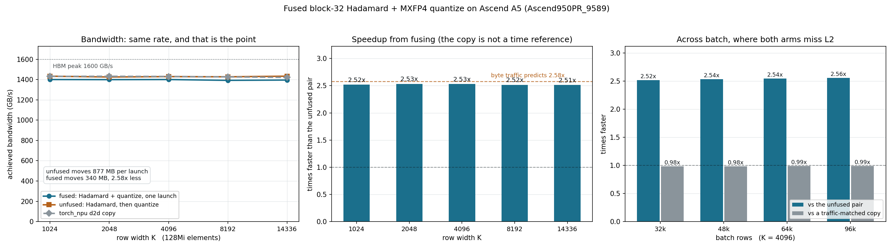
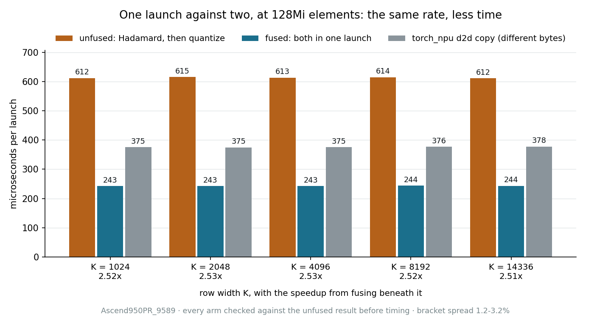
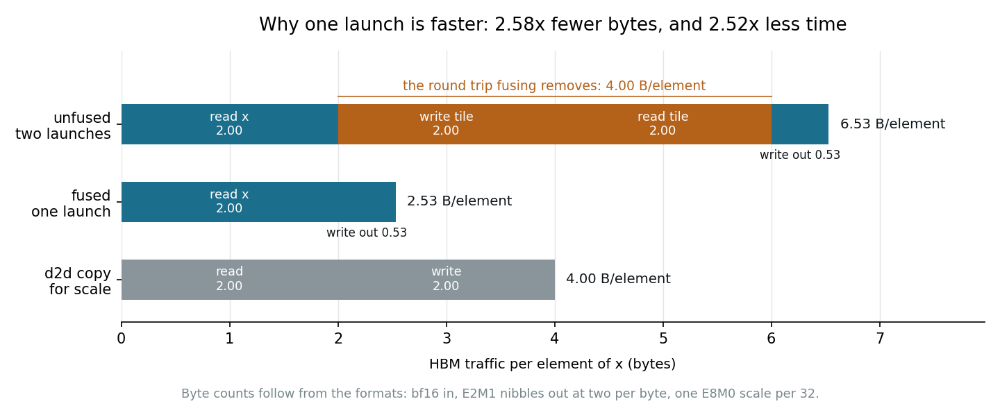
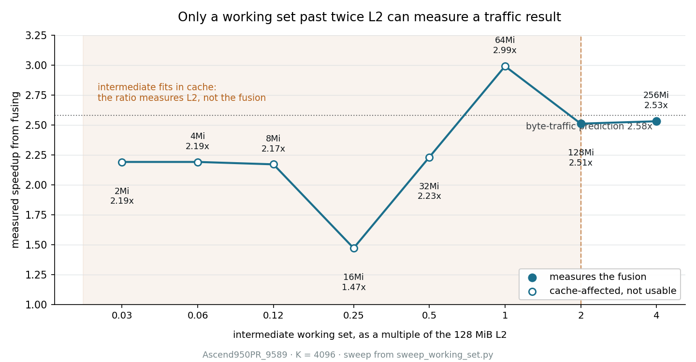

# fused_hadamard_quant_a5 — fusing a block-32 Hadamard with MXFP4 quantization

`x -> block-32 Hadamard -> E2M1 nibbles + one E8M0 scale per 32`, one launch, on
an Ascend 950 / A5 (`dav-c310-vec`): the rotation and the quantizer, measured
against the same two as separate launches.



## Both arms reach the same bandwidth, so the win is traffic

| K | unfused | fused | copy | unfused GB/s | fused GB/s | copy GB/s | vs unfused |
|---|--:|--:|--:|--:|--:|--:|--:|
| 1024 | 611.8 | 242.7 | 375.2 | 1433 | 1400 | 1431 | **2.52x** |
| 2048 | 615.1 | 242.9 | 374.9 | 1425 | 1399 | 1432 | **2.53x** |
| 4096 | 613.4 | 242.6 | 375.4 | 1429 | 1400 | 1430 | **2.53x** |
| 8192 | 614.5 | 244.1 | 376.5 | 1427 | 1392 | 1426 | **2.52x** |
| 14336 | 611.5 | 243.5 | 377.9 | 1433 | 1395 | 1421 | **2.51x** |

Microseconds per launch. All three arms sit between 1392 and 1433 GB/s, 87-90% of
this part's 1.6 TB/s peak, so none of them is short of the memory system and the
speedup is not extra throughput. It is fewer bytes:

HBM bytes per element, counting each launch's reads and writes:

| | reads | writes | total |
|---|--:|--:|--:|
| Hadamard launch | `x`, 2.0 | rotated tile, 2.0 | 4.00 |
| quantize launch | rotated tile, 2.0 | nibbles 0.5, scales 0.03 | 2.53 |
| **unfused, both** | | | **6.53** |
| **fused, one launch** | `x`, 2.0 | nibbles 0.5, scales 0.03 | **2.53** |
| bf16 d2d copy, the width sweep's reference | 2.0 | 2.0 | 4.00 |

The whole 4.00 B/element difference is the intermediate's round trip: 2.0 to write
the rotated tile out and 2.0 to read it back. A launch boundary cannot carry data
in UB -- it is 248 KiB of per-core scratch that does not survive one -- so
unfused, that tile has to go to GM and come back. Fused, it stays in UB between
the butterfly and the quantizer and those two passes never happen.

6.53 / 2.53 = 2.58, against a measured 2.51-2.53.

Note the fused kernel does *more* UB and vector work per HBM byte, not less: the
tile crosses the UB boundary for three butterfly sweeps and then four quantizer
passes, where each unfused half does a subset. UB round trips cost almost nothing
on this part, which is why that shows up as the 3% below rather than as a
regression.

### Equal bandwidth and a 2.5x speedup are not in tension

The unfused arm reads slightly *higher* on the bandwidth panel while taking 2.5x
longer, which looks contradictory until the denominators are stated. At 128Mi
elements it moves 877 MB a launch; the fused kernel moves 340 MB. Bandwidth is
bytes over time, so a higher rate on 2.58x more bytes still finishes later:

    time ratio = byte ratio x (fused bandwidth / unfused bandwidth)
                 2.580      x  0.97                                = 2.50

which reproduces the measured ratio at every width to three decimals. The fused
kernel is about 3% slower per byte -- it has the butterfly and the quantizer
between its load and its store, where the unfused halves each do one of them --
and 2.5x faster per launch.

### The same result in microseconds



Bandwidth is the axis on which this result looks like nothing happened, so the
same measurement in time: 612 us unfused against 243 at K=1024, and flat across
every width. The copy bar is there for scale, not as a target, for the reason
the next section gives.



And the reason, per element of x. The unfused pair writes the rotated tile out
and reads it straight back, which is 4.00 B/element the fused kernel never moves
because the tile stays in registers. That predicts 2.58x and measures 2.52x.
`plot_duration_b32_a5.py` and `plot_byte_ladder_b32_a5.py` draw the two.

## Why the copy is on one panel and not the other

The copy moves 4 B/element where the fused kernel moves 2.53. On the bandwidth
panel every arm is charged for the bytes it actually moves, so the copy is the
right DMA reference there. A raw-time ratio against it would credit the kernel for
1.58x of traffic it never touches, so the speedup panel compares only against the
unfused pair.

## Across batch, at a fixed row width

The sweep above holds total elements constant and varies K. This one varies the
batch at K=4096, the axis
`examples/jit_cpp/fast_hadamard/fuse_int4_dynamic_quant` uses for the A2/A3 int4
kernel, and compares against a **traffic-matched copy**: a copy sized to move
exactly the bytes the fused kernel moves, which is the reference for this work
rather than for a bf16 tensor.

| batch rows | fused | traffic-matched copy | vs unfused | vs copy | fused GB/s | copy GB/s |
|---|--:|--:|--:|--:|--:|--:|
| 32,768 | 241.7 | 238.0 | **2.52x** | 0.98x | 1405 | 1428 |
| 49,152 | 359.6 | 354.4 | **2.54x** | 0.98x | 1417 | 1438 |
| 65,536 | 477.6 | 473.5 | **2.54x** | 0.99x | 1423 | 1435 |
| 98,304 | 714.9 | 705.7 | **2.56x** | 0.99x | 1426 | 1444 |

Microseconds per launch. Four points, agreeing to 0.04x, and against a copy of
the same bytes the kernel is **0.98-0.99x** -- the butterfly and the quantizer
together cost 1-2% over moving those bytes and doing nothing with them.

### Most batch sizes cannot measure this, and the sweep says which

| batch rows | regime | measured ratio | why |
|---|---|--:|---|
| 16 | dispatch | 2.15x | the kernel moves less than the ~13 us launch costs |
| 128 | dispatch | 2.14x | the kernel moves less than the ~13 us launch costs |
| 1,024 | dispatch | 2.14x | the kernel moves less than the ~13 us launch costs |
| 4,096 | cache | 1.31x | bandwidth reads above the part's 1.6 TB/s peak, so it is served from L2 |
| 16,384 | cache | 3.32x | bandwidth reads above the part's 1.6 TB/s peak, so it is served from L2 |

The dispatch rows are not wrong, they answer a different question: at a decode
shape, fusing saves one launch of two and that is worth 2.14-2.15x. But the
kernel's duration there is flat -- 12.8 us at 16 rows and 12.8 at 1024, while the
work grows 64x -- so the ratio is dispatch arithmetic and not traffic.

The cache rows are the dangerous ones. At 16384 rows the unfused intermediate is
exactly 1x the 128 MiB L2 and the sweep reads **3.32x**, better than the true
2.5x. Nothing about a flattering number invites suspicion, so it is caught by
the bandwidth check rather than by reading the ratio: 1936 GB/s exceeds this
part's 1.6 TB/s peak, which is only possible from cache.

`batch_sweep.csv` carries `launch_bound` and `l2_resident` columns, and
`plot_fused_hadamard_quant_b32_a5.py` draws only the clean rows.



`plot_working_set_b32_a5.py` draws it from `working_set_sweep.txt`. Only the two
rows at or past twice L2 land on the byte-traffic prediction; everything to the
left of the dashed line is measuring cache. A second run of the same sweep gave
2.16x where this one gave 2.19x at the smallest sizes, which is the other half
of the argument, but that run's data was not kept so it is not on the chart.

## Method

`bench_fused_hadamard_quant_b32.py` on an `Ascend950PR_9589`: 64 vector cores,
128 MiB L2, 1.65 GHz. Wall clock on a saturated queue, medians over 15 brackets
of 20 launches, inputs from a rotating pool. Bracket spread 1.9-2.4%.


Fused and unfused are compared against each other before either is timed and
agree to a relative error of 0.0; a disagreement aborts the run rather than
printing a table whose rows measure different computations.

**Constant total elements, not constant M.** At 128Mi elements per launch the
unfused intermediate is 256 MB at every K, twice the 128 MiB L2. Holding M fixed
instead lets the small-K intermediate fit in cache, which flatters the unfused arm
and understates fusing.

**128Mi is the smallest size where both arms are actually HBM-bound.**
`sweep_working_set.py` walks the working set over seven doublings at K=4096;
`working_set_sweep.txt` is its output. Below 128Mi nothing is memory-bound and
the ratio is a cache artifact:

| elements | intermediate | x L2 | unfused GB/s | copy GB/s | ratio | spread |
|---|--:|--:|--:|--:|--:|--:|
| 8Mi | 17 MB | 0.12 | 1964 | 4343 | 2.17x | 6.0% |
| 16Mi | 34 MB | 0.25 | 3533 | 5404 | 1.47x | 4.4% |
| 32Mi | 67 MB | 0.50 | 2405 | 2573 | 2.23x | 2.4% |
| 64Mi | 134 MB | 1.00 | 1508 | 1464 | 2.99x | 2.2% |
| **128Mi** | 268 MB | 2.00 | **1435** | 1417 | **2.51x** | 2.2% |
| **256Mi** | 537 MB | 4.00 | **1441** | 1401 | **2.53x** | 1.3% |

A copy at 5404 GB/s is 3.4x this part's 1.6 TB/s peak, so those rows are serving
from L2 rather than HBM and their ratios mean nothing about fusing. Note how
unstable they are between runs: an earlier pass of the same sweep put 16Mi at
1.32x and 64Mi at 3.10x against the 1.47x and 2.99x here, while the two
HBM-bound rows moved by 0.02x. The two rows at and above 2x L2 also carry the
tightest spreads in the sweep, 2.2% and 1.3%, which is why the figure uses
128Mi.

Absolute GB/s belongs to this part. Other A5 SKUs differ by nearly 2x in HBM, so
the ratios travel and the absolutes do not.

## Files

```
bench_fused_hadamard_quant_b32.py       the fused-vs-unfused benchmark across widths
fused_hadamard_quant_b32.csv            what that run recorded
plot_fused_hadamard_quant_b32_a5.py     the three-panel figure
plot_duration_b32_a5.py                 the same arms in microseconds
plot_byte_ladder_b32_a5.py              where the bytes go, per element
bench_batch_sweep.py                batch at a fixed width, with a matched copy
batch_sweep.csv                     what that run recorded
sweep_working_set.py                the size sweep behind the 128Mi choice
working_set_sweep.txt               its output
plot_working_set_b32_a5.py              which working sets can measure a traffic result
```

The kernel is in `pto-kernels` at `examples/jit_cpp/fused_hadamard_quant_b32_a5/`;
this benchmark imports its `jit_util_fused_b32_a5` and runs from that directory.
