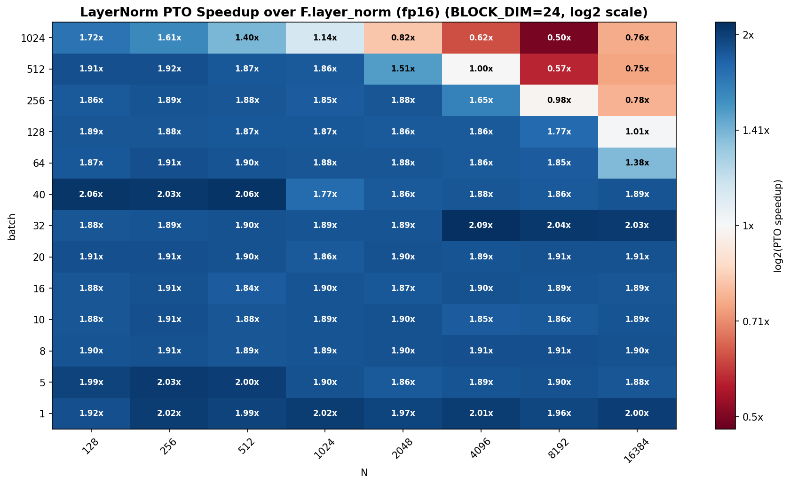

# LayerNorm PTO-ISA vs PyTorch

Layer normalization benchmark results for the PTO-ISA `fp16` LayerNorm kernel compared
against PyTorch `F.layer_norm` on Ascend NPU.

The benchmark sweep covers batch size and hidden dimension (`N`) for the `BLOCK_DIM=24`
kernel configuration. The plotted value is:

```text
speedup = PyTorch F.layer_norm runtime / PTO-ISA runtime
```

Values above `1.0x` mean the PTO-ISA kernel is faster. Values below `1.0x` mean
`F.layer_norm` is faster.

---

## Plots

### `layernorm_speedup_heatmap_bd24.png`



PTO-ISA speedup over `F.layer_norm` for `fp16` inputs, shown on a log2 color scale.
Blue cells indicate PTO-ISA is faster; red cells indicate `F.layer_norm` is faster.

**What the plot shows:**

- For small and medium batches (`batch <= 128`), the PTO-ISA kernel is consistently
  faster across almost the full hidden-dimension sweep, usually around **1.8-2.1x**.
- The strongest region is at low-to-mid batch sizes, where the custom kernel avoids much
  of the framework overhead while still having enough work per launch to use the device.
- At `batch=256`, PTO-ISA remains faster up to `N=4096`, reaches near parity at
  `N=8192`, and falls behind at `N=16384`.
- At larger batches (`batch=512` and `batch=1024`), performance becomes shape-sensitive.
  PTO-ISA remains competitive for smaller `N`, but PyTorch becomes faster for the
  largest hidden dimensions.
- The worst observed case is `batch=1024, N=8192`, where PTO-ISA is about **0.50x** the
  speed of `F.layer_norm`. This suggests the current schedule is not optimal once both
  batch and row length are large enough for the PyTorch implementation to amortize its
  overhead and saturate memory bandwidth more effectively.

**Conclusion:** the `BLOCK_DIM=24` PTO-ISA LayerNorm kernel is strong for latency-sensitive
small-to-medium shapes and reaches roughly **2x speedup** over `F.layer_norm` in many of
those cases. The main remaining optimization target is the large-batch, large-hidden-dim
region, where the benchmark indicates bandwidth or tiling efficiency is limiting the
custom implementation.
