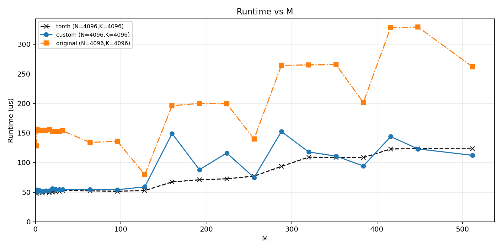

# Matmul with L2 Cache Locality Optimization (Swizzle)

PTO-ISA matrix multiplication kernel with a swizzled tile traversal order designed to
improve L2 cache reuse. Without swizzling, the default tile iteration order causes
adjacent tiles to be mapped to widely-separated L2 cache lines, leading to thrashing
at large M. The swizzled order groups tiles so that successive tiles along the M
dimension share cached rows of the B matrix, reducing HBM re-reads.

Benchmarks are run on two hardware targets:
- **Ascend 910B2** — sweeping large M in steps of 128
- **Ascend 910B4** — sweeping small-to-moderate M

All measurements use `N=4096, K=4096`. Three implementations are compared:
- `torch` — PyTorch matmul (framework baseline)
- `custom` — PTO-ISA matmul with swizzle optimization
- `original` — PTO-ISA matmul without swizzle

---

## Plots

### `comparison_910B2_stepsize_128.png`

Runtime (μs) vs M for M ∈ [128, 4096] at step size 128, on Ascend 910B2.

**What the plot shows:**

- The `original` kernel (orange, dashed) is extremely uncompetitive. It starts at
  roughly the same runtime as the others for small M (~200 μs at M=500) but diverges
  badly, reaching **~1675 μs at M=4096** — over **3x slower than torch** (~460 μs) and
  over **3x slower than custom** (~570 μs) at that point.
- The `original` curve is also highly irregular, with large variance spikes of ±200–400
  μs across adjacent M values. This is the signature of L2 cache thrash: access
  patterns are sensitive to exact tile alignment and lead to non-deterministic reuse.
- The `custom` kernel (blue solid) closely follows `torch` (black dashed) throughout
  the sweep. Both grow nearly linearly with M.
- At large M, `custom` is consistently about **20–30% above torch**, which likely
  reflects kernel launch overhead or tiling inefficiency that torch's cuBLAS/hccl
  backend avoids rather than a cache problem.
- **Conclusion:** the swizzle optimization fully eliminates the cache-thrash pathology
  of the original, bringing runtime in line with the framework baseline.

---

### `comparison_910B4.png`

Runtime (μs) vs M for M ∈ [1, 512], on Ascend 910B4.

**What the plot shows:**

- At very small M (≤128), all three implementations have similar latency (~50–60 μs),
  dominated by fixed kernel dispatch and synchronization overhead. The swizzle benefit
  does not matter when M is too small to produce meaningful L2 reuse anyway.
- Beyond M ~128, the `original` kernel jumps to **130–200 μs** and continues rising
  to **~325 μs at M=420**, while `torch` and `custom` stay near **50–150 μs**.
- `custom` closely tracks `torch` and in several regions actually **outperforms it**
  (e.g. M ~380, where `custom` reaches ~95 μs vs ~110 μs for torch). This is
  consistent with the 910B4 having a different L2 topology where the swizzle pattern
  aligns more favorably than torch's default schedule for certain M values.
- The `custom` curve is noisier than torch (larger variance between adjacent M values),
  suggesting the optimal tile mapping is still sensitive to M alignment on this
  hardware.
- **Conclusion:** on 910B4 the speedup over `original` is substantial across all M > 128,
  and `custom` is competitive with torch throughout the range shown.
