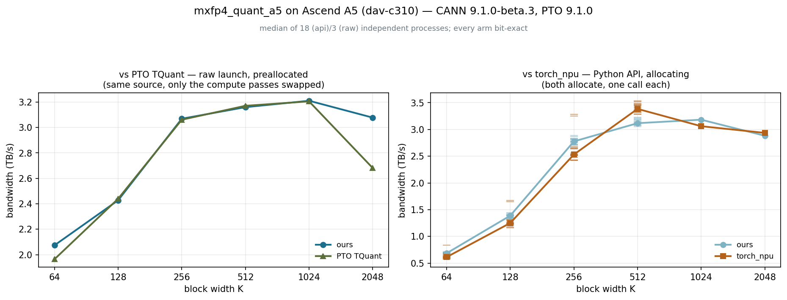
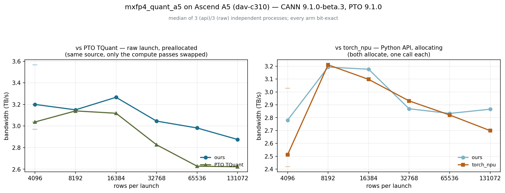

# MXFP4 block quantization on Ascend A5: <br/> beating the vendor op on the path you actually call

- Author: Hyun-Min Chang

**TL;DR**: MXFP4 quantization (bf16 -> one 4-bit E2M1 nibble per element plus one
shared E8M0 scale per 32) is a **memory-bound streaming op**: every element is read
once, 0.53125 bytes per element are written, and nothing is reused. So the
question is not FLOPs but how much of HBM you keep. Our A5 (`dav-c310`) kernel
reaches **3.21 TB/s**. Against **PTO 9.1.0's own
`TQuant_MXFP4_E2M1`** on an identical launch it is ahead or level at
**6 of 6** widths (1.00-1.13x),
and against **`torch_npu`** on the user-facing path ahead at **4 of
6** (0.92-1.11x) -- with the caveat
that `torch_npu` is not a stable baseline at narrow widths: it has a second,
faster kernel that turns up in about one process in 15, and at K=512 it takes
that path every time, which is the one width where it clearly beats us. Every arm is
**bit-exact** with the vendor op, checked before it is timed.

The result that took the longest to get right was not a kernel change. It was
realising that **the call path decides the number**: pairing a bare `ctypes` launch
against a Python wrapper invents a 1.67x that does not exist.

**To reproduce everything in this post**, see:
- Kernel, benchmark, correctness tests:
  [`pto-kernels/examples/jit_cpp/mxfp4_quant_a5`](https://github.com/huawei-csl/pto-kernels/tree/master/examples/jit_cpp/mxfp4_quant_a5)
- Plots and raw CSV data: this directory. The plotting scripts live here rather than
  in the upstream PR, which ships only the kernel, its benchmark and its tests. The
  CSV emitted by `benchmark.py` is the contract between the two:

  ```bash
  # in pto-kernels/examples/jit_cpp/mxfp4_quant_a5 (needs an A5 device)
  ./run_benchmark.sh --axis k     --tag 1     # -> build/pairs_k_1.csv
  ./run_benchmark.sh --axis batch --tag 1     # -> build/pairs_batch_1.csv
  ./run_benchmark.sh --axis k --pairs api \
      --ks 256,512,768,1024,1280,1536 --tag peak1
  # the mode study: one process per tag, m01 .. m15
  ./run_benchmark.sh --axis k --pairs api --ks 64,128,256,512 --tag m01

  # here (needs only matplotlib)
  python plot_mxfp4_beta3.py --csv <path>/build/pairs_k_*.csv     --out mxfp4_beta3_by_k.png
  python plot_mxfp4_beta3.py --csv <path>/build/pairs_batch_*.csv --out mxfp4_beta3_by_batch.png --axis batch
  ```

All numbers: one Ascend 950 / A5 device, **CANN 9.1.0-beta.3 with PTO 9.1.0** (what
the repository's CI containers use), bf16 in, `block_dim` = 64 vector cores,
64 interleaved brackets per process. Sweeps run in 3 independent
processes, and the narrow widths of the `torch_npu` comparison in 15 more,
for the reason given under
[the peak](#is-the-torch_npu-peak-at-k512-real).

# Outline

- [Background: the op, and why it is memory-bound](#background-the-op-and-why-it-is-memory-bound)
- [The call path decides the number](#the-call-path-decides-the-number)
- [Against PTO TQuant: compute, isolated](#against-pto-tquant-compute-isolated)
- [Against torch_npu: the path a user calls](#against-torch_npu-the-path-a-user-calls)
- [Rows per launch](#rows-per-launch)
- [Is the torch_npu peak at K=512 real?](#is-the-torch_npu-peak-at-k512-real)
- [What the Python wrapper costs](#what-the-python-wrapper-costs)
- [Correctness: bit-exact, not close](#correctness-bit-exact-not-close)
- [How the timing works](#how-the-timing-works)

# Background: the op, and why it is memory-bound

MXFP4 splits a row into blocks of 32. Each block gets one **E8M0** scale byte -- a
bare power of two, derived from the block maximum -- and each element becomes a
4-bit **E2M1** code, two codes packed per byte. For a `(batch, K)` bf16 input that
is `2K` bytes read and `K/2 + K/32` bytes written per row: **2.53125 bytes per
element** of traffic, and one pass over the data with no reuse whatsoever.

The compute is a block maximum, a reciprocal, a convert and a pack. On A5 that is
a handful of vector ops per 128 lanes, against 2.53 bytes of DMA. There is no
arithmetic intensity to exploit, so the kernel is judged on bandwidth and every
number in this post is GB/s counting read + write with that one formula.

# The call path decides the number

This is the part worth reading if you take nothing else from this post. The kernel
can be invoked three ways, and they are not interchangeable:

| path | what it is | Python per call |
|---|---|---|
| **raw** | a bare `ctypes` launch, outputs preallocated by the caller | nothing |
| **prealloc** | `quant(x, out=(q, s))` -- the wrapper, caller's buffers | checks, padding arithmetic |
| **API** | `quant(x)` -- the wrapper allocates and slices | the above, plus two allocations |

PTO's `TQuant` is a device-side tile op: you reach it through a **raw** launch.
`torch_npu.npu_dynamic_mx_quant` is a Python call that allocates its own outputs,
so it can only be compared against our **API**. Pair them across paths and you are
measuring our wrapper, not either kernel -- which is exactly how an early version
of this benchmark reported a 1.67x for TQuant that evaporated the moment both arms
used the same launch. Hence two figures below, never one.

# Against PTO TQuant: compute, isolated

The cleanest experiment available: `benchmark.py` compiles **the same source file
twice**, the second time with `-DMXFP4_TQUANT`, which swaps our four compute passes
for the vendor tile op and changes nothing else -- same tiling, same buffering, same
`TLOAD`/`TSTORE`, same UB regions (the vendor scratch aliases onto ours, so there is
not even a footprint difference). Whatever is left is compute.



| K | 64 | 128 | 256 | 512 | 1024 | 2048 |
|---|---|---|---|---|---|---|
| ours (raw) (GB/s) | **2074** | **2428** | **3069** | **3160** | **3210** | **3078** |
| PTO `TQuant` (GB/s) | 1964 | 2440 | 3061 | 3170 | 3205 | 2681 |

Ahead or level at every width, by -0% to
+13%. That is the honest shape of this result: the
vendor's quantizer is good, and on a memory-bound op there is not much room between
two implementations that both keep the DMA busy. The gap is widest where the
per-tile compute is a larger share of the tile's time.

# Against torch_npu: the path a user calls

Both arms are one Python call that allocates its own outputs.

| K | 64 | 128 | 256 | 512 | 1024 | 2048 |
|---|---|---|---|---|---|---|
| ours (API) (GB/s) | **685** | **1389** | **2777** | **3118** | **3183** | **2883** |
| `torch_npu` (GB/s) | 614 | 1251 | 2532 | 3385 | 3061 | 2936 |

Ahead at 4 of 6 widths; behind at K=512, K=2048.
Those losses are real on this toolchain, and the K=512 one has a specific cause --
see below.

One caveat that matters for anyone repeating this: `torch_npu` dispatches into
`libopapi_nn.so` from whatever CANN build is on `ASCEND_HOME_PATH`. It is **not** a
fixed reference. The same script on 9.0.0 and on 9.1.0-beta.3 measures different
vendor numbers, so rows are only comparable within one toolkit version.

# Rows per launch

Width fixed, rows swept, so this varies the launch's total work rather than its
shape.



| rows | 4096 | 8192 | 16384 | 32768 | 65536 | 131072 |
|---|---|---|---|---|---|---|
| ours (raw) (GB/s) | **3200** | **3150** | **3266** | **3046** | **2982** | **2876** |
| PTO `TQuant` (GB/s) | 3038 | 3140 | 3119 | 2827 | 2628 | 2623 |

| rows | 4096 | 8192 | 16384 | 32768 | 65536 | 131072 |
|---|---|---|---|---|---|---|
| ours (API) (GB/s) | **2780** | **3193** | **3176** | **2869** | **2833** | **2866** |
| `torch_npu` (GB/s) | 2511 | 3210 | 3098 | 2930 | 2821 | 2699 |

# Is the torch_npu peak at K=512 real?

It is the sharpest feature on either curve and the only width where we lose
meaningfully, so it got 5 more processes across the multiples of 256 around
it.

| K | 256 | 512 | 768 | 1024 | 1280 | 1536 |
|---|---|---|---|---|---|---|
| ours (API) (GB/s) | **2753** | **3095** | **3218** | **3160** | **2979** | **2845** |
| `torch_npu` (GB/s) | 2356 | 3395 | 2964 | 3037 | 2867 | 2960 |

`torch_npu` reaches **3395 GB/s** at K=512 against **3001** averaged
over its neighbours at 768 and 1024 -- a **13%** spike
that reproduced in every one of those 5 processes. So it is real. But asking
*why* turned up something more useful than a peak.

Running the narrow widths in **15 independent processes** shows `torch_npu`
has **two modes**, and which one a process gets is decided before the first
measurement:

| K | processes | main mode, GB/s (n) | second mode, GB/s (n) | separation |
|---|---|---|---|---|
| 64 | 15 | 612 (all 15) | -- | none, spread 18% |
| 128 | 15 | 1251 (14) | 1653 (1) | +27% |
| 256 | 15 | 2532 (14) | 3282 (1) | +24% |
| 512 | 15 | 3367 (all 15) | -- | none, spread 7% |

At **K=128 and K=256** one process in 15 gets a kernel roughly a quarter
faster than the other fourteen; the rest of the time the vendor runs well behind us
and we win comfortably. At **K=512** there is no split -- all 15 processes
land in the fast band -- which is exactly why K=512 reads as a peak, and why the
loss there is the one that holds up. K=64 shows no clean split either: its widest
gap is smaller than the ordinary spread of the remaining samples, so that is a tail
rather than a mode.

Two things follow. A three-process median cannot settle the narrow widths: draw the
rare fast process once and a real win reads as a loss, which is what happened to an
earlier version of this post. And our own arm does nothing of the kind -- its
cross-process spread is 6-9% at these widths
-- so what moves is the vendor's kernel selection, not the machine.

# What the Python wrapper costs

The two `ours` arms differ only in Python. At K=64 the raw launch reads
**2074 GB/s** and the API **685** -- a
**3.0x** difference -- and by K=2048 it is
**1.07x**. The wrapper is a fixed per-call cost, so it
matters only where the launch is small. Worth knowing before optimising the kernel
for narrow rows: at K=64 the argument checking, the padding arithmetic and the two
allocations dominate what the device does.

# Correctness: bit-exact, not close

The nibbles and the scale bytes are compared with `torch.equal` against
`torch_npu.npu_dynamic_mx_quant`, not with a tolerance -- a relative-error check
would accept a subtly wrong rounding mode or a shifted exponent. `pytest` is
**88 passed** on real A5, covering every supported width, batches that are not
multiples of the tile, eight adversarial block families, the partial-tile tail and
rejection of unsupported arguments.

Two conventions had to match exactly, and both were found by the bit-exact check
rather than by reading anything: the scale is derived with **round-to-nearest**
(`rint`), and the vendor's `scaleAlg=0`. Using `floor` instead moves 27% of the
scale bytes -- still a plausible-looking quantizer, and wrong.

**Every arm in every table above is bit-exact**;
the benchmark gates each contender before timing it, so a broken kernel cannot
report a fast number.

# How the timing works

Ascend's event timer proved unreliable for a single launch here -- one launch
measured 82, 28, 7.6 and 24 microseconds on repeat readings -- so every number is a
**saturated queue**: 64 launches between two synchronizes, wall clock
divided by the count, identically for every arm.

Contenders are **interleaved one bracket at a time with a rotating order**. With a
fixed order the first arm in each bracket absorbs the previous one's cache
eviction, which was enough to make the preallocated path measure ~8% *slower* than
the allocating one -- a pure artifact of ordering.

Within one process the paired per-bracket ratio is tight, and an early version of
this benchmark quoted its bootstrap interval. That was the wrong interval: it
describes noise inside one process and says nothing about `torch_npu` selecting a
different kernel in the next one. So the published bar is the **median process**,
the whiskers are the **full spread across processes**, and each bar carries `n/N`
-- how many processes agreed on who was faster. A bar goes hollow under 80%
agreement. That is what makes K=512 (18/18 for `torch_npu`) a settled loss while
K=64 (16/18 for us) is a win with a known exception.
