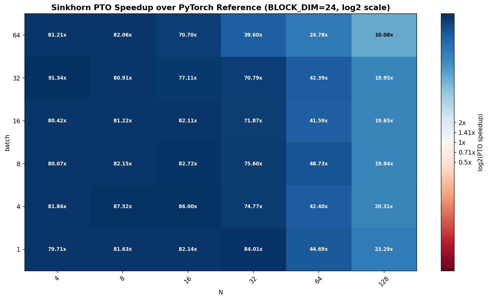

# Doubly-Stochastic Sinkhorn Normalization PTO-ISA vs PyTorch

Benchmark results for the PTO-ISA `fp16` doubly-stochastic Sinkhorn normalization
kernel compared against PyTorch `fp16` on Ascend NPU.

Doubly-stochastic Sinkhorn normalization iteratively normalizes rows and columns
of a matrix so that both sum to approximately the same value — producing a
doubly-stochastic matrix. It is used in the DeepSeek MHC (Multi-Head Chunked)
pre-processing pipeline for mixing-weight normalization.

The algorithm:
```
x = softmax(x, dim=-1) + eps
x = x / (x.sum(dim=-2) + eps)        # column-normalize
repeat (repeat-1) times:
    x = x / (x.sum(dim=-1) + eps)    # row-normalize
    x = x / (x.sum(dim=-2) + eps)    # column-normalize
```

The benchmark sweeps batch size and matrix dimension `N` (K×K square matrices),
with `repeat=10` iterations, `eps=1e-6`. The plotted value is:

```text
speedup = PyTorch runtime / PTO-ISA runtime
```

Values above `1.0x` mean the PTO-ISA kernel is faster.

---

## Plots

### `sinkhorn_speedup_heatmap_bd24.png`



PTO-ISA speedup over PyTorch doubly-stochastic Sinkhorn, shown as a heatmap
over batch size and matrix dimension on a log2 color scale.

**What the plot shows:**

- The PTO-ISA kernel is faster than PyTorch across **every shape tested**,
  ranging from **10x** to **91x**.
- For small matrix dimensions (`N=4` to `N=16`), the kernel achieves
  **~80-91x** speedup regardless of batch size. At these sizes the
  entire K×K matrix fits easily in UB and the fused kernel eliminates
  all PyTorch op-dispatch overhead.
- As the matrix dimension grows, the speedup decreases: **~70-84x** at `N=32`,
  **~25-49x** at `N=64`, and **~10-23x** at `N=128`. The reduction comes from
  the row-by-row column-normalization loop (`colNormDiv`), which has
  K iterations of vector divide + barrier.
- The speedup is remarkably stable across batch sizes for small `N`,
  because the kernel assigns one matrix per vector core and the 48 cores
  absorb batches up to 48 without additional latency.
- At `batch=64, N=128` (the heaviest tested point), the kernel is still
  **10x** faster than PyTorch.

**Conclusion:** the PTO-ISA doubly-stochastic Sinkhorn kernel delivers
large speedups over PyTorch for all tested shapes, with the biggest wins
(80-91x) at the small matrix dimensions typical of DeepSeek MHC
(`hc_mult` = 4, 8, or 16).
