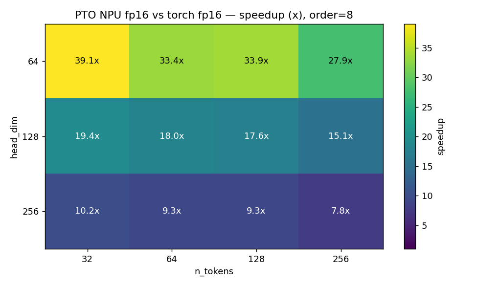
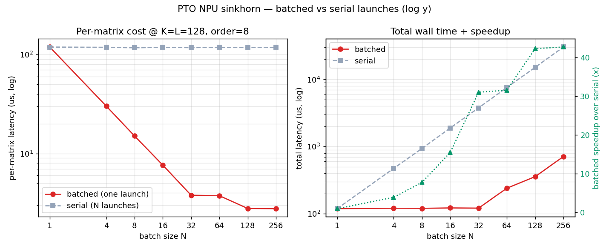

# Sinkhorn Normalization PTO-ISA vs PyTorch

Benchmark results for the PTO-ISA `fp16` Sinkhorn normalization kernel compared
against vectorised PyTorch `fp16` on Ascend NPU.

Sinkhorn normalization iteratively scales the rows and columns of a matrix until
the standard deviations in both directions converge to a common target.  It is
used as a weight-normalization step in transformer quantization pipelines
(QuIP#, etc.).

The benchmark sweeps head dimension (`K`) and token count (`L`) at `batch=1`,
`order=8` iterations, `lr=0.9`.  The plotted value is:

```text
speedup = PyTorch torch fp16 runtime / PTO-ISA runtime
```

Values above `1.0x` mean the PTO-ISA kernel is faster.

---

## Plots

### `sinkhorn_speedup.png`



PTO-ISA speedup over vectorised PyTorch `fp16` Sinkhorn, shown as a heatmap
over head dimension and token count.

**What the plot shows:**

- The PTO-ISA kernel is faster than PyTorch across **every shape tested**,
  ranging from **7.8x** to **39.1x**.
- The speedup is largest for small head dimensions (`K=64`), where
  the fused kernel avoids the overhead of many small PyTorch op launches.
  At `K=64, L=32` the kernel reaches **39.1x** speedup.
- Even at the largest tested shape (`K=256, L=256`) the PTO-ISA kernel
  is still **7.8x** faster.
- The speedup decreases as shape grows, because the PyTorch overhead
  becomes a smaller fraction of the total runtime.  The PTO-ISA kernel
  remains dominant because it fuses all 8 Sinkhorn iterations, all
  reductions, and the final output write into a single kernel launch.

### `sinkhorn_batched_vs_serial.png`



Batched launch (one kernel call for `N` matrices) vs serial launch
(`N` separate kernel calls) at `K=L=128`, `order=8`.

**What the plot shows:**

- **Left panel:** per-matrix latency.  A single batched launch at `N=256`
  brings the per-matrix cost down to **~2.8 us**, compared to **~119 us**
  per matrix when launched serially.
- **Right panel:** total wall time and speedup ratio (green line).
  Batched launch achieves up to **~43x** throughput improvement at `N=256`,
  because the 48 vector cores process matrices in parallel.
- For `N <= 32` the batched launch keeps total latency nearly flat at
  ~120 us (all matrices fit within the available cores).  Beyond that,
  total latency grows linearly but per-matrix cost plateaus.

**Conclusion:** the PTO-ISA Sinkhorn kernel delivers large speedups over
PyTorch for all tested transformer head shapes, and scales efficiently with
batched launches across the NPU's vector cores.
