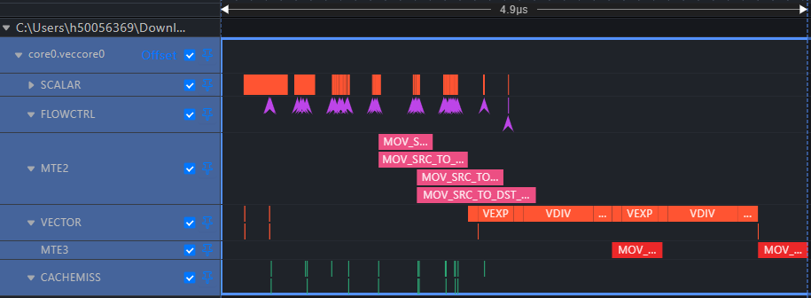
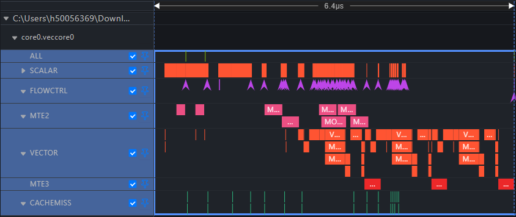
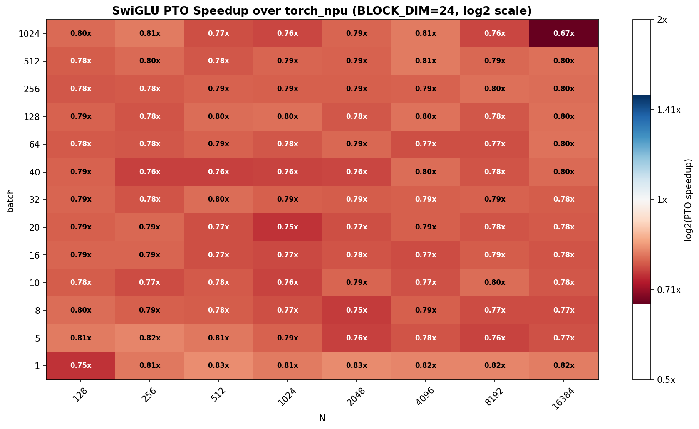
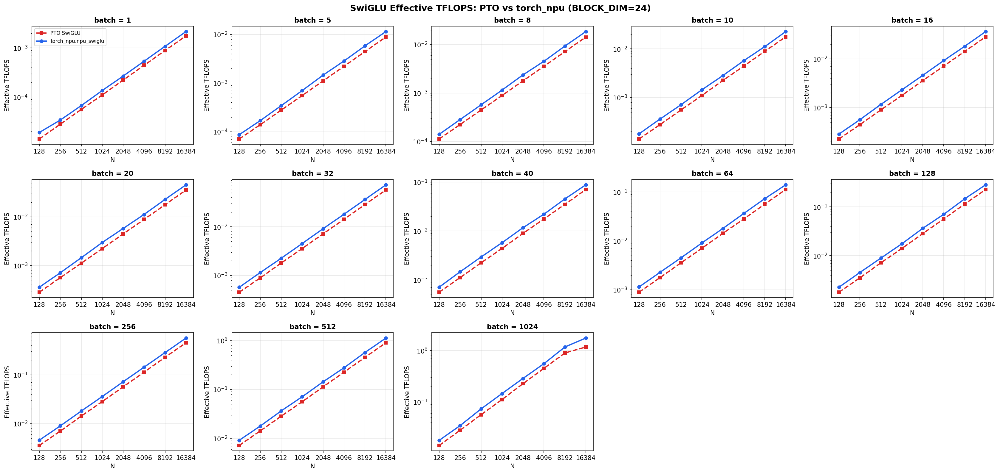

# swiGLU PTO-ISA vs torch_npu

## msprof on simulator
|PTO-ISA|torch_npu|
|---------|-----------|
|||

## msprof on device
|PTO-ISA|torch_npu|
|---------|-----------|
|||

## python benchmark
|Speedup Heatmap|Bandwidth Comparison|
|---------|-----------|
|||

PTO-ISA is around `24% faster` than torch_npu for simulated profiling and `13% faster`for on device profiling.

But in the python benchmark it is has `0.78x` the speed of torch_npu.